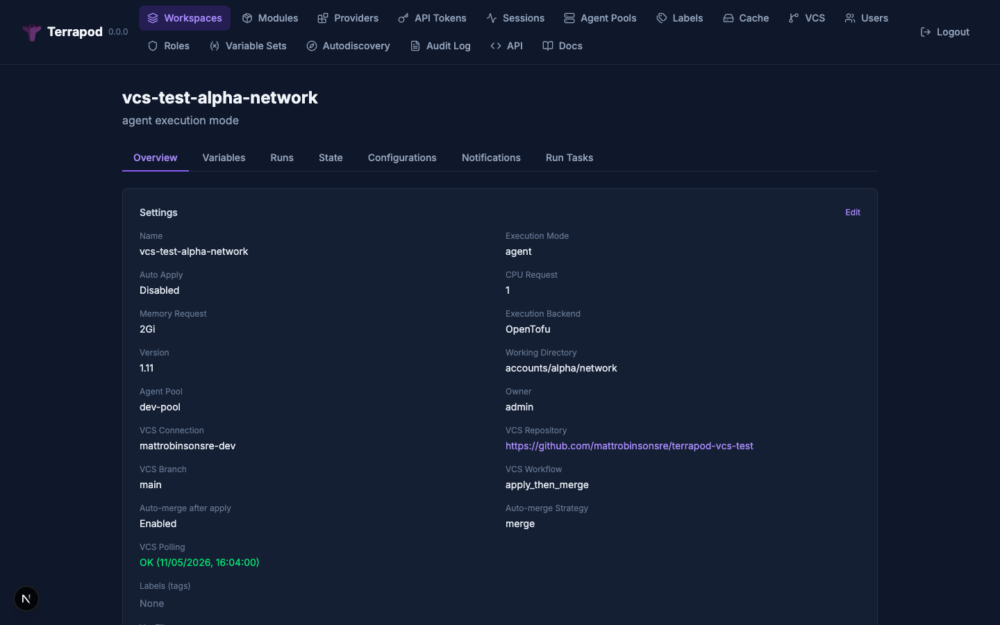
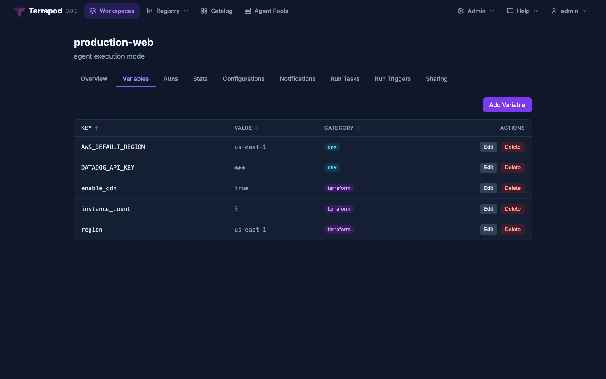

# Terrapod

[](https://github.com/mattrobinsonsre/terrapod/actions/workflows/ci.yml)
[](LICENSE)

**Open-source platform replacement for Terraform Enterprise.**

Terrapod provides the collaboration, governance, state management, and UI layer that wraps around `terraform` or `tofu` as pluggable execution backends. It targets API compatibility with the [HCP Terraform / TFE V2 API](https://developer.hashicorp.com/terraform/enterprise/api-docs) so that existing tooling -- the `terraform` CLI with `cloud` block, the [`go-tfe`](https://pkg.go.dev/github.com/hashicorp/go-tfe) client, CI/CD integrations -- can point at a Terrapod instance with minimal reconfiguration.

Terrapod is **not** a fork of Terraform or OpenTofu. It orchestrates them.


> **Drop-in replacement for HCP Terraform.** Point your existing `cloud` blocks, `go-tfe` clients, and CI/CD pipelines at Terrapod — zero code changes required.

---

## Key Features

| Feature | Status | Description |
|---|---|---|
| Workspaces | Implemented | Isolate state, variables, and runs per workspace |
| Remote State Management | Implemented | Versioned state storage with locking, rollback, encryption at rest via CSP services |
| Agent Execution | Implemented | Plan/apply runs on the server via K8s Job-based runner infrastructure |
| VCS Integration | Implemented | GitHub (App) and GitLab (access token); polling-first with optional webhooks |
| Variables & Secrets | Implemented | Per-workspace env and Terraform variables; sensitive values protected by database encryption-at-rest; variable sets |
| RBAC | Implemented | Label-based role system with hierarchical workspace permissions (read/plan/write/admin) |
| Private Module Registry | Implemented | Publish, version, and share modules internally |
| Private Provider Registry | Implemented | Publish, version, and share providers with GPG signing and network mirror caching |
| Binary Caching | Implemented | Pull-through cache for terraform/tofu CLI binaries |
| Agent Pools | Implemented | Named groups of runner listeners; join token → certificate exchange for auth |
| CLI-Driven Runs | Implemented | `terraform plan` / `apply` via cloud backend (both `terraform` and `tofu` verified) |
| TFE V2 API | Implemented | JSON:API surface compatible with `go-tfe` / `terraform login` |
| Audit Logging | Implemented | Immutable event log with configurable retention |
| SSO (OIDC / SAML) | Implemented | Pluggable identity providers (Auth0, Okta, Azure AD, etc.) |
| Drift Detection | Implemented | Scheduled plan-only runs to detect out-of-band changes |
| Run Triggers | Implemented | Cross-workspace dependency chains — source apply triggers downstream runs |
| Notifications | Implemented | Webhook (HMAC-SHA512), Slack (Block Kit), and email alerts on run events |
| Run Tasks | Implemented | Pre/post-plan webhook hooks for external validation |
| Workspace Health | Implemented | Per-workspace health conditions, VCS polling status, drift detection indicators |
| Cloud Credentials | Implemented | Dynamic provider credentials via K8s workload identity (AWS IRSA, GCP WIF, Azure WI) |

### Screenshots

<details>
<summary>Workspace overview with VCS integration, drift detection, and labels</summary>


</details>

<details>
<summary>Run detail with plan output and VCS metadata</summary>


</details>

<details>
<summary>Variables with sensitive masking and HCL support</summary>


</details>

<details>
<summary>Agent pools with listener health monitoring</summary>


</details>

---

## Architecture

```
                              +---------------------+
                              |     Browser / CLI    |
                              +----------+----------+
                                         |
                                     HTTPS (TLS)
                                         |
                              +----------v----------+
                              |      Ingress         |
                              +----------+----------+
                                         |
                              +----------v----------+
                              |   Next.js Frontend   |  (BFF pattern)
                              |   (Web UI + Proxy)   |
                              +----+------------+---+
                                   |            |
                        /app/*     |            |  /api/*  /.well-known/*
                        (pages)    |            |  (rewrite to API)
                                   |            |
                              +----v------------v---+
                              |   FastAPI API Server |
                              +--+------+------+----+
                                 |      |      |
                    +------------+   +--+--+   +------------+
                    |                |     |                 |
              +-----v-----+  +-----v-+ +-v----------+ +----v-------+
              | PostgreSQL |  | Redis | | Object     | | VCS Polls  |
              | (data,     |  | (sess | | Storage    | | (GitHub,   |
              |  state     |  |  ions,| | (S3/Azure/ | |  GitLab)   |
              |  metadata) |  |  locks| |  GCS/FS)   | +------------+
              +-----------+   +------+  +-----------+
                                              ^
                              +---------------+
                              |               |
                    +---------v----------+    |
                    |  Runner Listener   |    |  (one or more, each
                    |  (K8s Deployment,  |    |   joins a pool via
                    |   joins pool via   |    |   join token)
                    |   join token)      |    |
                    +---------+----------+    |
                              |               |
                    +---------v----------+    |
                    |  K8s Jobs          |    |
                    |  (ephemeral        |    |
                    |   terraform/tofu)  |    |
                    +--------------------+    +
```

### Design Principles

- **API-first** -- every UI action is backed by a public API endpoint
- **BFF pattern** -- Next.js frontend is the single ingress entry point; browser never talks to the API directly
- **Kubernetes-native** -- deployed exclusively via Helm chart; runner Jobs are ephemeral K8s Jobs
- **ARC-pattern execution** -- listener creates Jobs on demand (like GitHub Actions Runner Controller)
- **OpenTofu-first** -- [OpenTofu](https://opentofu.org/) is the recommended execution backend; `terraform` is also supported
- **Single organization** -- one org per instance; the TFE V2 API accepts `{org}` in paths for CLI compatibility but only `default` is valid
- **Native object storage** -- speaks each cloud provider's native SDK (S3, Azure Blob, GCS) with filesystem fallback for dev

---

## Quick Start

### Prerequisites

- A local Kubernetes cluster (Rancher Desktop, Docker Desktop, minikube, kind, or OrbStack)
- [Tilt](https://tilt.dev/) installed
- [mkcert](https://github.com/FiloSottile/mkcert) for local TLS

### Setup

```zsh
# Install mkcert and create local CA
brew install mkcert && mkcert -install

# Add hosts entry
sudo sh -c 'echo "127.0.0.1 terrapod.local" >> /etc/hosts'

# Start Terrapod
make dev
```

Tilt starts on port 10352. Open https://terrapod.local in your browser.

### Create Your First Workspace

```zsh
# Login (default admin credentials from bootstrap)
export TERRAPOD_TOKEN="<your-api-token>"

# Create a workspace
curl -X POST https://terrapod.local/api/v2/organizations/default/workspaces \
  -H "Authorization: Bearer $TERRAPOD_TOKEN" \
  -H "Content-Type: application/vnd.api+json" \
  -d '{
    "data": {
      "type": "workspaces",
      "attributes": {
        "name": "my-first-workspace"
      }
    }
  }'
```

### Configure OpenTofu (or Terraform)

```hcl
# main.tf
terraform {
  cloud {
    hostname     = "terrapod.local"
    organization = "default"

    workspaces {
      name = "my-first-workspace"
    }
  }
}
```

```zsh
tofu login terrapod.local
tofu init
tofu plan
tofu apply
```

For detailed instructions, see [docs/getting-started.md](docs/getting-started.md).

---

## Production Deployment

Terrapod is deployed via Helm chart on Kubernetes. Images and chart are published to GHCR.

```zsh
helm install terrapod oci://ghcr.io/mattrobinsonsre/terrapod \
  --namespace terrapod \
  --create-namespace \
  --set ingress.enabled=true \
  --set ingress.hostname=terrapod.example.com \
  --set postgresql.url="postgresql+asyncpg://user:pass@db:5432/terrapod" \
  --set redis.url="redis://redis:6379"
```

Required infrastructure:
- **PostgreSQL** (v14+) for relational data
- **Redis** (v7+) for sessions, locks, and listener heartbeats
- **Object storage** (S3, Azure Blob, GCS, or PVC-backed filesystem)

See [docs/deployment.md](docs/deployment.md) for the full production deployment guide.

---

## Authentication

Terrapod supports multiple authentication methods:

- **Local passwords** -- PBKDF2-SHA256 hashed, with zxcvbn strength validation
- **OIDC** -- Auth0, Okta, Azure AD, and any standards-compliant provider via authlib
- **SAML** -- Azure AD SAML and other SAML 2.0 providers via python3-saml
- **terraform login** -- OAuth2 Authorization Code with PKCE for CLI authentication
- **API tokens** -- long-lived tokens for automation, SHA-256 hashed at rest

See [docs/authentication.md](docs/authentication.md) for setup guides.

---

## Documentation

| Document | Description |
|---|---|
| [Architecture](docs/architecture.md) | System components, BFF pattern, storage, runners, auth flows |
| [Getting Started](docs/getting-started.md) | Local development setup, first workspace, first plan/apply |
| [Authentication](docs/authentication.md) | Local auth, OIDC, SAML, terraform login, API tokens |
| [RBAC](docs/rbac.md) | Permission model, label-based access control, custom roles |
| [API Reference](docs/api-reference.md) | All API endpoints with examples |
| [Deployment](docs/deployment.md) | Production Helm deployment, storage backends, scaling |
| [Registry](docs/registry.md) | Private module/provider registry, caching layers |
| [VCS Integration](docs/vcs-integration.md) | GitHub and GitLab setup, polling, webhooks |
| [Drift Detection](docs/drift-detection.md) | Scheduled plan-only runs to detect infrastructure drift |
| [Run Triggers](docs/run-triggers.md) | Cross-workspace dependency chains |
| [Notifications](docs/notifications.md) | Webhook, Slack, and email alerts on run events |
| [Run Tasks](docs/run-tasks.md) | Pre/post-plan webhook hooks for external validation |
| [Audit Logging](docs/audit-logging.md) | Immutable event log, query API, retention |
| [Cloud Credentials](docs/cloud-credentials.md) | AWS IRSA, GCP WIF, Azure WI setup |
| [Monitoring](docs/monitoring.md) | Prometheus metrics, scraping, recommended alerts |
| [Disaster Recovery](docs/disaster-recovery.md) | Break-glass state recovery from object storage |

---

## Tech Stack

| Layer | Technology |
|---|---|
| API server | Python 3.13+ / FastAPI / SQLAlchemy (async) / Pydantic |
| Database | PostgreSQL |
| Cache / Sessions | Redis |
| Object storage | AWS S3, Azure Blob, GCS, or filesystem (native SDKs) |
| Frontend | Next.js 15 / React 19 / TypeScript / Tailwind CSS / Radix UI |
| Runner listener | Python (same codebase as API) |
| Auth | authlib (OIDC), python3-saml (SAML) |
| Deployment | Helm chart on Kubernetes |
| CI | GitHub Actions |

---

## Development

All builds, tests, and linting run in Docker -- no local Python or Node.js install needed.

```zsh
make dev          # Start local dev environment (Tilt)
make dev-down     # Stop local dev environment
make test         # Run pytest in Docker (with LocalStack for S3)
make lint         # Run ruff + mypy in Docker
make images       # Build production Docker images
```

### Conventions

- **Commits**: conventional commits (`feat:`, `fix:`, `docs:`, `chore:`)
- **Branches**: feature branches off `main`; never push directly to `main`
- **API contract**: JSON:API spec; compatibility tested against `go-tfe` client
- **Migrations**: Alembic with async SQLAlchemy
- **Local dev**: Tilt with live_update for Python and Node.js hot reload

---

## Security Testing

Terrapod includes a three-layer pen testing framework. All tools run in Docker.

```zsh
make pentest-sast     # Static analysis (Semgrep)
make pentest-images   # Container image CVE scan (Trivy)
make pentest-dast     # Dynamic testing against live stack (Nuclei)
make pentest          # All three layers
```

| Layer | Tool | What it covers |
|-------|------|----------------|
| SAST | [Semgrep](https://semgrep.dev/) | OWASP Top 10, secrets detection, project-specific rules (naive datetimes, raw background tasks) |
| Container scanning | [Trivy](https://trivy.dev/) | HIGH/CRITICAL CVEs in `terrapod-api` and `terrapod-web` images |
| DAST | [Nuclei](https://nuclei.projectdiscovery.io/) | Auth bypass, header injection, CORS validation, state endpoint security, HTTP method restriction |

Reports are written to `reports/pentest/`. See [SECURITY.md](SECURITY.md) for the full security policy.

---

## Comparison with Alternatives

| Project | What it does | Gap vs full TFE replacement |
|---|---|---|
| [OpenTofu](https://opentofu.org/) | Open-source Terraform fork (CLI) | CLI only -- no collaboration platform |
| [Atlantis](https://www.runatlantis.io/) | PR-based plan/apply automation | No UI, no state management, no registry, no RBAC |
| [Digger](https://digger.dev/) | CI-native Terraform orchestration | Runs inside CI; no standalone platform |
| [Terrateam](https://terrateam.io/) | GitHub-integrated TF automation | GitHub-coupled; limited community edition |
| [Spacelift](https://spacelift.io/) | Commercial TF management platform | Not open source |

Terrapod is the only open-source project that covers the full TFE surface: state management, agent execution, private registry, RBAC, VCS integration, drift detection, and a production-grade UI -- all in a single self-hosted Kubernetes deployment.

Terrapod is a single, self-hosted platform covering the full TFE surface (state + runs + registry + governance + UI + API) under a copyleft (GPLv3) license.

---

## License

[GPLv3](LICENSE) -- strong copyleft ensures Terrapod and all derivative works remain open source.

---

## Trademarks

Terrapod is not affiliated with, endorsed by, or a product of HashiCorp, Inc. or IBM. Terraform is a trademark of HashiCorp, Inc. OpenTofu is a project of the Linux Foundation.

---

## Contributing

Contributions are welcome. Please follow these guidelines:

1. Fork the repository and create a feature branch from `main`
2. Follow conventional commit format (`feat:`, `fix:`, `docs:`, `chore:`)
3. Run tests (`make test`) and linting (`make lint`) before submitting
4. Ensure all CI checks pass
5. Open a pull request with a clear description of the change

For architecture questions or major changes, open an issue first to discuss the approach.
