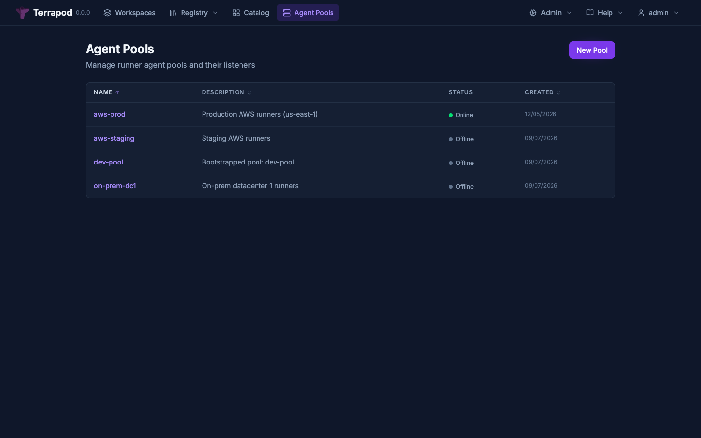
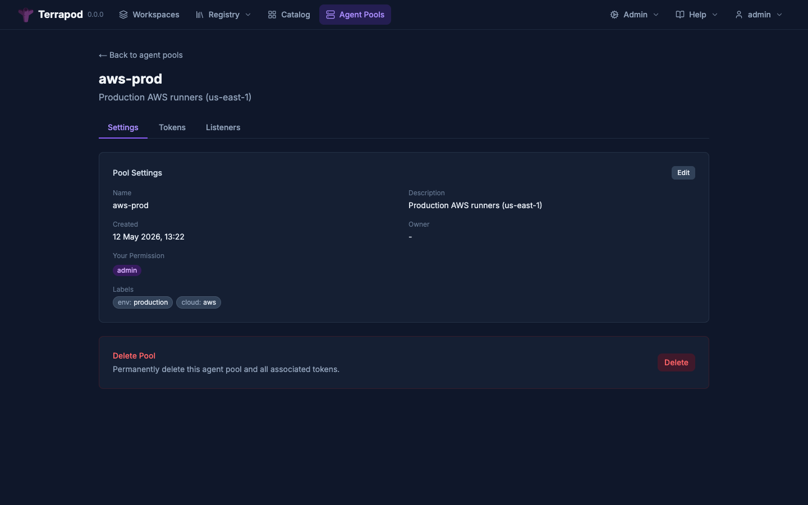
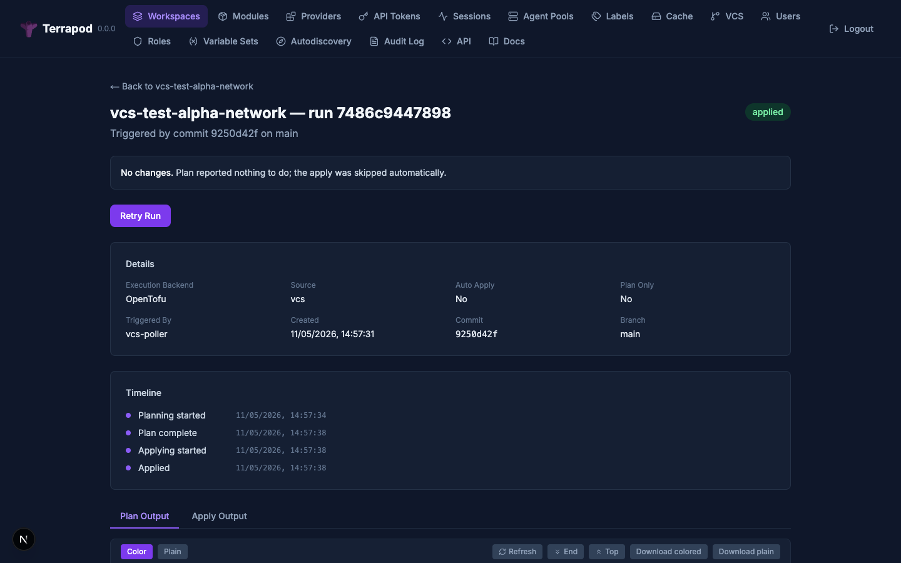

# Architecture

This document describes the internal architecture of Terrapod, covering system components, data flow, storage abstractions, the runner execution layer, authentication flows, and VCS integration.

---

## System Components

```
+-------------------------------------------------------------------+
|                        Kubernetes Cluster                          |
|                                                                    |
|  +---------------------+    +----------------------------------+  |
|  |   Ingress            |    |   terrapod namespace              |  |
|  |   (nginx / traefik)  |--->|                                  |  |
|  +---------------------+    |  +-------------+  +-----------+  |  |
|                              |  | Next.js Web |  | FastAPI   |  |  |
|                              |  | (BFF proxy) |->| API       |  |  |
|                              |  +-------------+  +-----+-----+  |  |
|                              |                         |         |  |
|                              |  +-------------+  +-----+-----+  |  |
|                              |  | Runner      |  | Migrations |  |  |
|                              |  | Listener    |  | (Alembic)  |  |  |
|                              |  +------+------+  +-----------+  |  |
|                              +---------|-------------------------+  |
|                                        |                           |
|  +-------------------------------------|-------------------------+ |
|  |   runner namespace                  |                         | |
|  |                           +---------v---------+               | |
|  |                           | K8s Job (runner)  |               | |
|  |                           | terraform / tofu  |               | |
|  |                           +-------------------+               | |
|  +---------------------------------------------------------------+ |
+-------------------------------------------------------------------+
         |              |              |
   +-----v----+  +-----v----+  +-----v---------+
   | PostgreSQL|  |  Redis   |  | Object Storage|
   | (external)|  | (external|  | (S3/Azure/GCS |
   +----------+   +----------+  |  /filesystem) |
                                +---------------+
```

### Component Responsibilities

| Component | Purpose | Implementation |
|---|---|---|
| **Next.js Web** | Single ingress entry point; serves UI pages and proxies API calls | Next.js 15, React 19, Tailwind CSS, Radix UI |
| **FastAPI API** | All business logic, TFE V2 API, auth, registry, VCS polling | Python 3.13+, FastAPI, SQLAlchemy async, Pydantic |
| **Runner Listener** | Receives run events via SSE, creates K8s Jobs, reports status, streams logs | Same Python codebase as API, different entrypoint |
| **Runner Jobs** | Ephemeral containers that execute `terraform` or `tofu` | Minimal Alpine image with curl/tar/jq |
| **PostgreSQL** | Relational data: users, workspaces, state metadata, runs, registry | PostgreSQL 14+ |
| **Redis** | Sessions, auth state, listener heartbeats, SSE event channels, Job status cache, API token role cache | Redis 7+ |
| **Object Storage** | State files, config tarballs, plan outputs, logs, registry artifacts, cache | S3, Azure Blob, GCS, or filesystem |

---

## BFF (Backend For Frontend) Pattern

All traffic enters through the Next.js frontend via a single Ingress rule. The browser never communicates directly with the FastAPI API server.

```
Browser                Next.js (port 3000)         FastAPI API (port 8000)
  |                         |                              |
  |--- GET /workspaces ---->|                              |
  |    (page render)        |                              |
  |<--- HTML + JS ----------|                              |
  |                         |                              |
  |--- GET /api/v2/... ---->|                              |
  |    (data fetch)         |--- proxy /api/* ------------>|
  |                         |<-- JSON response ------------|
  |<--- JSON response ------|                              |
```

**How it works:**

- `next.config.js` defines rewrites: `/api/*` and `/.well-known/*` are proxied to the API service via the `API_URL` environment variable (e.g., `http://terrapod-api:8000`)
- The Ingress has a single backend: the web service
- This eliminates CORS entirely -- all requests are same-origin from the browser's perspective
- In production, only the web service needs to be exposed; the API service is cluster-internal

**Source files:**
- `web/next.config.js` -- rewrite rules
- `helm/terrapod/templates/ingress.yaml` -- single-backend Ingress
- `helm/terrapod/templates/deployment-web.yaml` -- API_URL env var injection

---

## Real-Time Updates (SSE + Polling)

The frontend uses two strategies for keeping data fresh without manual page reloads:

### Server-Sent Events (SSE)

High-priority pages that users watch actively use SSE for instant updates. The API publishes events to Redis pub/sub channels; SSE endpoints subscribe and forward events to the browser through the BFF proxy.

**SSE channels:**

| Redis Channel | SSE Endpoint | Frontend Hook | Used By |
|---|---|---|---|
| `tp:run_events:{ws_id}` | `GET /api/v2/workspaces/{id}/runs/events` | `useRunEvents` | Workspace detail page |
| `tp:workspace_list_events` | `GET /api/v2/workspace-events` | `useWorkspaceListEvents` | Workspace list page |
| `tp:pool_events:{pool_id}` | `GET /api/v2/agent-pools/{id}/events` | `usePoolEvents` | Agent pool detail page |
| `tp:admin_events` | `GET /api/v2/admin/health-dashboard/events` | `useAdminEvents` | Health dashboard |
| `tp:listener_events:{pool_id}` | `GET /api/v2/listeners/{id}/events` | (listener code) | Runner listeners |

**Shared SSE engine (`use-sse.ts`):**

All frontend SSE hooks are thin wrappers around a shared `useSSE` hook that provides:

- **Read timeout** (10s default) — if no data arrives (including keepalives sent every ~1s), the connection is assumed dead and reconnected. Catches NAT timeouts, load balancer idle disconnects, and hung backends.
- **Reconnect-triggered reload** — `onReconnect` callback fires after a successful reconnect (not initial connect), letting each page do a full data reload to catch events missed during the gap.
- **Exponential backoff** — 1s → 30s cap, resets on successful connection.
- **Visibility-aware** — pauses reconnection in background tabs, resumes on tab focus.
- **Connection status** — returns `connected` boolean for optional "Reconnecting..." UI indicator.

**BFF compression bypass:** SSE endpoints MUST have `Content-Encoding: none` headers configured in `web/next.config.js`. Without this, Next.js gzip compression buffers small SSE messages (keepalives, events) indefinitely because the encoder waits for enough data to fill a compression block.

**DB pool safety:** SSE endpoints MUST NOT use `Depends(get_current_user)` or `Depends(get_db)` — these hold database connections for the entire request lifetime, which for SSE means forever. Instead, SSE endpoints use `authenticate_request()` or `authenticate_listener()` which create short-lived sessions that are released before streaming begins.

### Polling

Medium-priority admin and registry pages use `usePollingInterval` for periodic data refresh:

| Page Category | Interval | Examples |
|---|---|---|
| Admin lists | 30s | Agent pools list, audit log |
| Admin/registry detail | 60s | Variable sets, users, roles, VCS, binary cache, modules, providers |

The polling hook is visibility-aware — it skips intervals when the tab is backgrounded.

---

## Storage Abstraction

Terrapod uses a protocol-based storage abstraction that supports four backends through their native SDKs. There is no S3 compatibility shim or MinIO dependency.

### ObjectStore Protocol

Defined in `services/terrapod/storage/protocol.py`:

```
ObjectStore Protocol
  |
  +-- put(key, data, content_type) -> None
  +-- get(key) -> bytes
  +-- delete(key) -> None
  +-- head(key) -> ObjectMeta
  +-- list(prefix) -> list[str]
  +-- presigned_get(key, expires) -> PresignedURL
  +-- presigned_put(key, content_type, expires) -> PresignedURL
```

### Backend Implementations

| Backend | Module | Auth | Use Case |
|---|---|---|---|
| **AWS S3** | `storage/s3.py` | IAM / IRSA | Production (AWS) |
| **Azure Blob** | `storage/azure.py` | Managed Identity / connection string | Production (Azure) |
| **GCS** | `storage/gcs.py` | Workload Identity / service account | Production (GCP) |
| **Filesystem** | `storage/filesystem.py` | HMAC-signed URLs | Local dev, CI |

### Storage Key Layout

All storage paths are constructed via `storage/keys.py`:

```
state/{workspace_id}/{version_id}.tfstate             # State files (encrypted at rest by object store)
config/{workspace_id}/{config_version_id}.tar.gz       # Configuration tarballs
plans/{workspace_id}/{run_id}.tfplan                    # Plan output
logs/{workspace_id}/plans/{run_id}.log                  # Plan logs
logs/{workspace_id}/applies/{run_id}.log                # Apply logs
registry/modules/{ns}/{name}/{prov}/{ver}.tar.gz        # Private modules
registry/providers/{ns}/{name}/{ver}/...                 # Private providers
cache/providers/{host}/{ns}/{type}/{ver}/{file}          # Cached providers
cache/binaries/{tool}/{ver}/{os}_{arch}                  # Cached CLI binaries
```

### Presigned URLs

File uploads and downloads for the **registry** (module tarballs, provider binaries, state version content) use presigned URLs. The API generates time-limited URLs; clients upload/download directly to/from storage. This keeps large files off the API server.

**Runner artifacts** (config archives, state files, plan files, logs) use a different pattern: authenticated API endpoints at `/api/v2/runs/{run_id}/artifacts/*` that require a runner token. Downloads return 302 redirects to presigned storage URLs; uploads are received directly by the API and written to storage. This eliminates the need for presigned URL env vars in runner Jobs.

For the filesystem backend, URLs are HMAC-signed and served by `storage/filesystem_routes.py` endpoints on the API server itself.

---

## Runner Architecture (ARC Pattern)

Terrapod's execution layer follows the Actions Runner Controller (ARC) pattern: a long-lived controller (the runner listener) receives events via SSE and creates ephemeral Kubernetes Jobs. The API owns all run lifecycle state via a periodic reconciler.

### Execution Flow

```
1. User/VCS creates a Run (status: pending → queued)
        |
2. API publishes "run_available" event to pool's SSE channel (Redis pub/sub)
        |
3. Listener receives SSE event → claims run: GET /api/v2/listeners/{id}/runs/next
        |
4. Listener requests a runner token:
   POST /api/v2/listeners/{id}/runs/{run_id}/runner-token
   - Returns short-lived HMAC-signed token scoped to run_id
        |
5. Listener creates K8s Job in runner namespace
   - Image: terrapod-runner (minimal Alpine)
   - Resources: from workspace config (cpu/memory requests + 2x limits)
   - Env vars: workspace variables + Terraform vars
   - TP_AUTH_TOKEN via secretKeyRef (token never in Job spec)
   - Service account: per-pool SA > global runner config SA > K8s default
   - Azure Workload Identity pod label added when `runners.azureWorkloadIdentity: true`
        |
6. Listener creates K8s Secret (tprun-{run_short}-auth)
   - Contains the runner token
   - ownerReference → Job (K8s GC deletes Secret when Job is cleaned up)
        |
7. Listener reports Job name/namespace back to API ← LISTENER IS DONE
        |
8. Runner Job starts (authenticates all API calls with TP_AUTH_TOKEN):
   a. Fetches terraform/tofu binary from binary cache (authenticated)
   b. Downloads config tarball via artifact endpoint (redirect-aware)
   c. Downloads current state via artifact endpoint (redirect-aware)
   d. Runs terraform init (providers via authenticated network mirror)
   e. Runs terraform plan (or apply)
   f. Uploads plan log + plan file via artifact endpoints (PUT)
   g. Reports has_changes to API (plan phase only)
        |
9. Run reconciler (30s periodic task) drives state transitions:
   a. Publishes "check_job_status" event via SSE → listener queries K8s
   b. Listener POSTs Job status to Redis
   c. Reconciler reads status from Redis → transitions run state
   d. On plan success + auto_apply: transitions to confirmed → apply phase
        |
10. Job completes, TTL controller cleans up after 10 minutes
    Secret is GC'd via ownerReference when Job is deleted
```

### Signal Forwarding and Graceful Termination

Runner Jobs handle SIGTERM gracefully for spot instance preemption:

```
K8s sends SIGTERM
    |
    v
runner-entrypoint.sh (traps SIGTERM/SIGQUIT)
    |
    v
Forwards signal to terraform/tofu child process
    |
    v
Terraform finishes current API call
    |
    v
Releases state lock
    |
    v
Exits cleanly
    |
    (120s terminationGracePeriodSeconds; SIGKILL if exceeded)
```

The entrypoint script is at `docker/runner-entrypoint.sh`.

### Agent Pools and Listeners



All listeners follow the same flow — there is no "local" vs "remote" distinction:

1. An admin creates an **agent pool** via the API (e.g. "production", "dev")
2. An admin generates a **join token** for the pool
3. The listener is configured with `TERRAPOD_JOIN_TOKEN` and `TERRAPOD_API_URL`
4. On startup, the listener calls `POST /api/v2/agent-pools/join` with the token
5. The API validates the token, issues an X.509 certificate (Ed25519), and returns the listener ID, cert, and pool ID
6. Certificates are saved to disk for restart persistence (avoiding unnecessary re-joins)
7. The listener authenticates subsequent API calls via `X-Terrapod-Client-Cert` header (base64-encoded PEM)
8. The listener connects to the SSE endpoint (`GET /api/v2/listeners/{id}/events`) — a persistent outbound HTTP stream for receiving events from the API
9. Heartbeats every 60s (180s TTL in Redis), SSE event loop handles run claims, Job status queries, log streaming, and cancellation

A listener can be deployed in the same cluster as the API or in a completely separate cluster — the join flow is identical. The SSE connection is outbound from the listener to the API, which works through firewalls without requiring inbound access. The Helm chart deploys a listener as a Deployment using the same Docker image as the API (`python -m terrapod.runner.listener`) with RBAC to create/watch/delete Jobs and Pods in the runner namespace.

**Multiple listener replicas** are supported for high availability. Set `listener.replicas > 1` — each pod derives a unique name by appending its Kubernetes pod name to the configured base name (`{base_name}-{pod_name}`). All replicas in a pool compete for queued runs via atomic Postgres locking (`SELECT ... FOR UPDATE SKIP LOCKED`). No leader election is required — Redis heartbeats track each listener independently, and stale records from terminated pods go offline after the 180s heartbeat TTL.



Pools are never auto-created. For initial deployment, the bootstrap job can optionally create a pool and join token when `TERRAPOD_BOOTSTRAP_POOL_NAME` is configured. For local development, Tilt automates this via a `setup-dev-pool` resource.

### Per-Workspace Resources

Each workspace has `resource_cpu` and `resource_memory` columns:

| Setting | Default | Description |
|---|---|---|
| `resource_cpu` | `1` | CPU request for runner Jobs |
| `resource_memory` | `2Gi` | Memory request for runner Jobs |

Limits are computed as 2x the requests automatically. Values are snapshotted to the `runs` table at run creation time so they remain stable even if the workspace is later modified.

---

## Certificate Authority

Terrapod includes a built-in Certificate Authority for authenticating runner listeners.

```
CA Initialization (first startup)
    |
    v
Generate Ed25519 keypair
CN = "Terrapod Certificate Authority"
Store in certificate_authority DB table (single row)
    |
    v
Listener Join Flow:
    1. Admin creates agent pool + join token
    2. Listener calls POST /api/v2/agent-pools/join with the token
    3. API validates join token (SHA-256 hash, expiry, max_uses)
    4. API issues X.509 certificate with SAN URIs:
       - terrapod://listener/{name}
       - terrapod://pool/{pool_name}
    5. Returns: listener ID, pool ID, certificate, private key, CA cert
    6. Listener saves certs to disk for restart persistence
    |
    v
Ongoing Authentication:
    - Listener sends X-Terrapod-Client-Cert header (base64 PEM)
    - API verifies: CA signature, expiry, CN->DB lookup, fingerprint match
    |
    v
Certificate Renewal:
    - At 50% of validity: POST /api/v2/listeners/{id}/renew
    - No re-registration needed on restart if stored cert is valid
```

**Source files:**
- `services/terrapod/auth/ca.py` -- CA keypair generation, certificate issuance
- `services/terrapod/api/routers/agent_pools.py` -- join and renew endpoints
- `services/terrapod/runner/identity.py` -- join token identity establishment

---

## Authentication Flows

### Web UI Login (Session-Based)

```
Browser                  Next.js              API               IDP (OIDC/SAML)
  |                         |                   |                     |
  |-- GET /login ---------->|                   |                     |
  |<-- Login page ----------|                   |                     |
  |                         |                   |                     |
  |-- Click SSO button ---->|                   |                     |
  |                         |-- GET /api/v2/auth/authorize ---------->|
  |                         |<-- redirect URL --|                     |
  |<-- 302 redirect --------|                   |                     |
  |                         |                   |                     |
  |-- Follow redirect ------------------------------------------------>|
  |<-- IDP login page ------------------------------------------------|
  |-- Authenticate -------------------------------------------------->|
  |<-- 302 to /auth/callback?code=xxx&state=yyy ----------------------|
  |                         |                   |                     |
  |-- GET /auth/callback?...                    |                     |
  |                         |-- validate state -->                    |
  |                         |-- exchange code --->                    |
  |                         |<-- session token --|                    |
  |<-- Set session, redirect to / --------------|                    |
```

### Terraform CLI Login (OAuth2 PKCE)

```
terraform login terrapod.local
  |
  |-- GET /.well-known/terraform.json
  |   Returns: { "login.v1": { "client": "terraform-cli", "grant_types": ["authz_code"],
  |              "authz": "/oauth/authorize", "token": "/oauth/token", ... } }
  |
  |-- Opens browser to /oauth/authorize?
  |   response_type=code&client_id=terraform-cli&
  |   code_challenge=xxx&code_challenge_method=S256&
  |   redirect_uri=urn:ietf:wg:oauth:2.0:oob:auto&state=yyy
  |
  |-- API stores auth state in Redis (5min TTL), redirects to IDP
  |-- User authenticates with IDP
  |-- IDP callback generates one-time auth code (60s TTL in Redis)
  |-- Browser receives auth code, terraform CLI extracts it
  |
  |-- POST /oauth/token
  |   grant_type=authorization_code&code=xxx&code_verifier=yyy
  |
  |-- API validates PKCE, creates API token in PostgreSQL
  |-- Returns: { "access_token": "{id}.tpod.{secret}", "token_type": "bearer" }
  |
  |-- terraform stores token in ~/.terraform.d/credentials.tfrc.json
```

### Unified Auth Dependency

The API uses a single auth dependency (`api/dependencies.py:get_current_user`) for all endpoints. Three authentication methods are evaluated in priority order:

```
Incoming request
  |
  v
1. If Authorization: Bearer <token> header present:
   a. Try runner token (fast, no I/O):
      - Token starts with "runtok:" prefix?
      - Verify HMAC-SHA256 signature + check expiry
      - Return AuthenticatedUser with auth_method="runner_token", run_id={scoped_run_id}
   b. Try API token lookup:
      - SHA-256 hash the token
      - Query api_tokens table by hash
      - Check max TTL (created_at + config TTL)
      - Resolve roles from role_assignments + platform_role_assignments
   c. Try session lookup:
      - Query Redis: tp:session:{token}
      - Slide TTL on hit (12h)
      - Return cached user + roles
  |
  v (no Bearer, or Bearer didn't match)
2. Return 401 Unauthorized
```

Runner tokens are checked first because verification is purely computational (HMAC comparison) with no database or Redis calls, making it the fastest path for the high-volume runner traffic.

---

## VCS Integration

Terrapod uses a polling-first design for VCS integration. No inbound connections are required -- only outbound HTTPS to VCS provider APIs.

```
+-------------------+                    +------------------+
|  API Server       |                    |  VCS Providers   |
|                   |                    |                  |
|  +-------------+  |   HTTPS (outbound) |  +------------+ |
|  | VCS Poller  |--+-------------------->  | GitHub API | |
|  | (async task)|  |    every 60s       |  +------------+ |
|  +------+------+  |                    |  +------------+ |
|         |         |   HTTPS (outbound) |  | GitLab API | |
|         |         +-------------------->  +------------+ |
|         |         |                    +------------------+
|         v         |
|  For each workspace with VCS:          +------------------+
|  1. Check branch HEAD SHA              | Optional:        |
|  2. Check open PRs/MRs                 | GitHub webhook   |
|  3. If new SHA detected:               | POST /api/v2/    |
|     - Download tarball                 | vcs-events/github|
|     - Create ConfigurationVersion      +--------+---------+
|     - Queue Run                                 |
|                                    triggers immediate poll
```

### Provider Dispatch

The `VCSProvider` protocol (`services/terrapod/services/vcs_provider.py`) defines the interface. The poller dispatches to the correct provider based on the VCS connection's `provider` field:

| Operation | GitHub | GitLab |
|---|---|---|
| Get branch SHA | GitHub API (installation token) | GitLab API (access token) |
| Get default branch | GitHub API | GitLab API |
| Download archive | GitHub API (tarball) | GitLab API (tarball) |
| List open PRs/MRs | GitHub API (pulls) | GitLab API (merge requests) |
| Parse repo URL | github.com/org/repo | gitlab.com/group/project |

For detailed setup instructions, see [vcs-integration.md](vcs-integration.md).

---

## Distributed Task Scheduler

The API server is designed to run with **multiple replicas** behind a load balancer. All background tasks -- periodic and event-triggered -- are coordinated via a distributed scheduler (`services/terrapod/services/scheduler.py`) using Redis. There is no leader election. Any replica can execute any task; Redis provides mutual exclusion.

### Periodic Tasks

Registered at startup with a name, interval, and async handler. Each replica runs a scheduler loop that tries `SET NX EX` on a Redis claim key every interval. Exactly one replica wins per interval. A separate "running" key (TTL = 3x interval) prevents overlap if a task execution exceeds its interval.

```
Replica A                Redis                    Replica B
    |                       |                         |
    |-- SET NX claim key -->|                         |
    |<-- OK (won) ---------|                         |
    |                       |<-- SET NX claim key ----|
    |                       |-- nil (lost) ---------->|
    |                       |                         |
    |-- execute task ------>|                         |
    |-- SET running key --->|                         |
    |   (TTL = 3x interval) |                         |
    |                       |                         |
    |-- task complete ----->|                         |
    |-- DEL running key --->|                         |
```

Currently registered periodic tasks:

| Task | Interval | Handler | Description |
|---|---|---|---|
| `vcs_poll` | 60s (configurable) | `vcs_poller.poll_cycle` | Poll VCS providers for new commits and PRs |
| `registry_vcs_poll` | 60s (configurable) | `registry_vcs_poller.poll_cycle` | Poll VCS for new module version tags |
| `audit_retention` | 86400s (daily) | `audit_service.purge_old_entries` | Purge audit log entries older than retention period |
| `drift_check` | 300s (configurable) | `drift_detection_service.drift_check_cycle` | Check workspaces for infrastructure drift |
| `run_reconciler` | 10s | `run_reconciler.reconcile_runs` | Drive run state transitions based on Job outcomes |

### Triggered Tasks

Event-driven work items pushed to a Redis LIST queue. Any replica's consumer loop dequeues and executes. Deduplication via `SET NX` with TTL prevents duplicate items (e.g. rapid-fire webhooks for the same repo).

Currently registered trigger handlers:

| Handler | Description | Dedup |
|---|---|---|
| `vcs_immediate_poll` | Webhook-triggered immediate VCS poll for a specific repo | Per repo (5 min) |
| `vcs_commit_status` | Post commit status to VCS provider on run state change | Per run+status (60s) |
| `notification_deliver` | Deliver workspace notification on run state change | Per run+trigger (60s) |
| `run_task_call` | Deliver run task webhook to external service | Per result (5 min) |
| `drift_run_completed` | Update workspace drift status when drift run completes | Per run (5 min) |

### Key Redis Patterns

| Key | Purpose | TTL |
|---|---|---|
| `tp:sched:{name}:claim` | Periodic task distributed mutex | interval |
| `tp:sched:{name}:running` | Task currently executing flag | 3x interval |
| `tp:sched:{name}:last` | Last completed execution timestamp | -- |
| `tp:sched:triggers` | Triggered task queue (Redis LIST) | -- |
| `tp:sched:trigger:{dedup}` | Trigger deduplication key | 5 min |

### Adding New Scheduled Tasks

To add a new background task:

1. Write an async handler function (no arguments for periodic, `dict` argument for triggered)
2. In `app.py` lifespan, call `register_periodic_task()` or `register_trigger_handler()`
3. The scheduler starts all registered tasks automatically via `start_scheduler()`

**Never** use `asyncio.create_task()` directly for background work in the API server. Always use the scheduler to ensure multi-replica correctness.

**Source:** `services/terrapod/services/scheduler.py`

---

## Run State Machine

```
pending -----> queued -----> planning -----> planned -----> confirmed -----> applying -----> applied
                                |               |                               |
                                v               v                               v
                             errored         discarded                       errored

Any non-terminal state -----> canceled (user action)
```



**Terminal states:** `applied`, `errored`, `discarded`, `canceled`

**Key behaviors:**
- `auto_apply=true`: planned transitions automatically to confirmed, then applying
- `auto_apply=false`: planned waits for user confirmation
- Workspace is locked during an active run and unlocked on terminal state
- Queue dispatch uses `SELECT ... FOR UPDATE SKIP LOCKED` (PostgreSQL job queue pattern)
- Plan-only (speculative) runs skip the apply phase entirely
- **Run options** — runs can carry optional CLI flags: `-target` (resource targeting), `-replace` (force resource replacement), `-refresh-only`, `-refresh=false`, `-allow-empty-apply`. These are stored on the run, passed through the listener to the runner Job as env vars (`TP_TARGET_ADDRS`, `TP_REPLACE_ADDRS`, `TP_REFRESH_ONLY`, `TP_REFRESH`, `TP_ALLOW_EMPTY_APPLY`), and applied as CLI arguments by the entrypoint
- **Drift detection** runs are plan-only runs created by the `drift_check` scheduler task. They detect out-of-band infrastructure changes without applying anything. See [Drift Detection](drift-detection.md)
- **Run tasks** can gate transitions at `pre_plan`, `post_plan`, and `pre_apply` boundaries. A mandatory task failure blocks the run until an admin overrides. See [Run Tasks](run-tasks.md)
- **Run triggers** fire when a non-speculative run reaches `applied` — downstream workspaces automatically get new runs queued. See [Run Triggers](run-triggers.md)
- **Notifications** are dispatched asynchronously on state transitions. See [Notifications](notifications.md)

---

## Database Schema

The database schema is managed by Alembic migrations in `alembic/versions/`. Key models (defined in `services/terrapod/db/models.py`):

| Model | Purpose |
|---|---|
| `User` | User accounts (email, provider, hashed password) |
| `Role` | Custom roles with allow/deny labels and workspace_permission |
| `RoleAssignment` | Maps (provider, email) to custom roles |
| `PlatformRoleAssignment` | Maps (provider, email) to platform roles (admin, audit) |
| `APIToken` | Long-lived API tokens (SHA-256 hashed) |
| `Workspace` | Workspace config, VCS settings, labels, owner |
| `StateVersion` | State version metadata (serial, lineage, MD5) |
| `Variable` | Per-workspace variables (sensitive values protected by database encryption-at-rest) |
| `VariableSet` | Org-scoped variable sets with workspace assignments |
| `ConfigurationVersion` | Uploaded configuration tarballs |
| `Run` | Run lifecycle (status, timestamps, VCS metadata, resources) |
| `AgentPool` | Named runner pool with service account |
| `AgentPoolToken` | Join tokens for listener registration |
| `RunnerListener` | Registered listener identity and certificate |
| `CertificateAuthorityModel` | CA keypair for listener certificates |
| `VCSConnection` | VCS provider auth config (GitHub App or GitLab token) |
| `RegistryModule` / `RegistryModuleVersion` | Private module registry |
| `RegistryProvider` / `RegistryProviderVersion` / `RegistryProviderPlatform` | Private provider registry |
| `GPGKey` | GPG keys for provider signing |
| `CachedProviderPackage` | Pull-through provider cache entries |
| `CachedBinary` | Pull-through CLI binary cache entries |
| `RunTrigger` | Cross-workspace dependency chains |
| `AuditLog` | Immutable API request log entries |
| `NotificationConfiguration` | Workspace notification configs (webhook/Slack/email) |
| `RunTask` / `TaskStage` / `TaskStageResult` | Run task webhooks and callback tracking |

---

## Observability

Both the API server and runner listener expose Prometheus metrics on their existing HTTP ports (no separate metrics ports). Metrics are feature-gated via `settings.metrics.enabled` (default: `true`).

### API Server Metrics

Exposed at `GET /metrics` on port 8000 (same FastAPI app). A middleware records request-level metrics for every HTTP request:

| Metric | Type | Labels | Description |
|---|---|---|---|
| `terrapod_http_requests_total` | Counter | method, path_template, status | Total HTTP requests |
| `terrapod_http_request_duration_seconds` | Histogram | method, path_template, status | Request latency |

Path templates use FastAPI route patterns (`/api/v2/workspaces/{workspace_id}`) to avoid high-cardinality raw paths. The `/metrics` endpoint itself is excluded from instrumentation. Built-in process metrics (CPU, memory, file descriptors, threads) are included automatically by `prometheus-client`.

When `metrics.enabled` is `false`, no middleware is registered and `/metrics` returns 404.

### Listener Metrics

Exposed at `GET /metrics` on port 8081 (same health HTTP server). Uses a separate `CollectorRegistry` to avoid conflicting with the API server's default registry:

| Metric | Type | Description |
|---|---|---|
| `terrapod_listener_active_runs` | Gauge | Number of currently active runner Jobs |
| `terrapod_listener_identity_ready` | Gauge | 1 if identity established, 0 otherwise |
| `terrapod_listener_heartbeat_age_seconds` | Gauge | Seconds since last successful heartbeat (-1 if never) |

### Prometheus Operator Integration

The Helm chart includes ServiceMonitor (API) and PodMonitor (listener) resources for Prometheus Operator. Both are disabled by default and independently gated:

- **ServiceMonitor** requires `metrics.enabled` AND `metrics.serviceMonitor.enabled`
- **PodMonitor** requires `metrics.enabled` AND `metrics.podMonitor.enabled` AND `listener.enabled`

See [Deployment -- Metrics](deployment.md#metrics) for Helm values.

**Source files:**
- `services/terrapod/api/metrics.py` -- API metrics middleware and endpoint
- `services/terrapod/runner/listener.py` -- listener metrics (CollectorRegistry)
- `helm/terrapod/templates/servicemonitor-api.yaml` -- ServiceMonitor
- `helm/terrapod/templates/podmonitor-listener.yaml` -- PodMonitor

---

## Configuration

Terrapod uses a layered configuration system:

1. **YAML config** -- mounted at `/etc/terrapod/config.yaml` (from Helm ConfigMap)
2. **Environment variables** -- prefix `TERRAPOD_`, nested with `__` delimiter
3. Environment variables override YAML values

Example: `TERRAPOD_STORAGE__BACKEND=s3` overrides `storage.backend` from YAML.

Runner configuration is separate, loaded from `/etc/terrapod/runners.yaml`.

**Source:** `services/terrapod/config.py`
