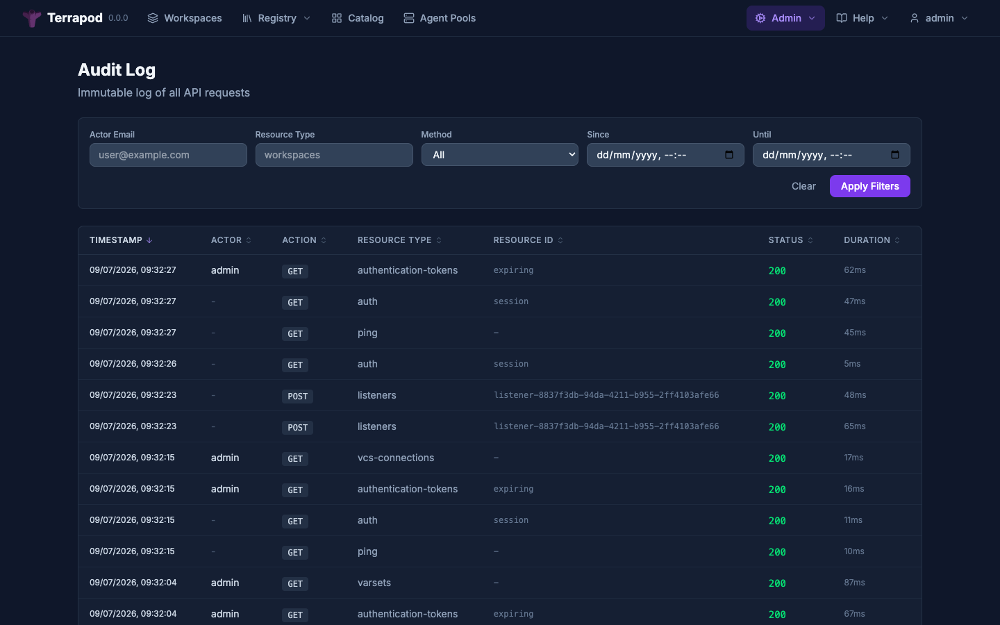

# Audit Logging

Terrapod maintains an immutable audit log of all API requests for compliance and operational visibility. Every API call is recorded with the actor, action, resource, status code, and timing.



---

## What Gets Logged

All API requests are logged except:

- `/health*` and `/ready*` (health checks and readiness probes)
- `/api/docs`, `/api/redoc`, `/api/openapi.json` (OpenAPI documentation)

Each audit entry captures:

| Field | Description |
|---|---|
| `timestamp` | Request time (RFC3339 UTC) |
| `actor-email` | Authenticated user's email (empty if unauthenticated) |
| `actor-ip` | Client IP address (IPv4 or IPv6) |
| `actor-type` | `terrapod_user` for normal API/UI/CLI calls; `vcs_user` for PR-comment-driven actions in [apply-then-merge](vcs-workflows.md) |
| `actor-login` | VCS-side display login (e.g. GitHub username) when `actor-type=vcs_user`; empty otherwise |
| `actor-id` | Provider-side immutable user id (e.g. GitHub user id) when `actor-type=vcs_user`; empty otherwise |
| `origin` | How the request entered the system: `api` (default), `terrapod_ui`, `pr_comment`, `system` |
| `action` | HTTP method (GET, POST, PATCH, DELETE) or comment verb (e.g. `vcs_apply`, `vcs_plan`, `vcs_force_merge`) for `actor-type=vcs_user` |
| `resource-type` | Extracted from URL (e.g. `workspaces`, `runs`) |
| `resource-id` | Resource identifier from URL (empty for collection endpoints) |
| `status-code` | HTTP response status code |
| `request-id` | Unique request identifier |
| `duration-ms` | Request execution time in milliseconds |
| `detail` | Additional context (e.g. resource name, action detail) |

Logging is asynchronous — it does not block the API response.

### Dual-actor model

Apply-then-merge workflows delegate authorization to the VCS provider (see [VCS Workflows](vcs-workflows.md#authorization-model-for-apply-then-merge--read-this-carefully)). Comment-driven actions (`terrapod plan`, `terrapod apply`, `terrapod merge`, etc.) are recorded with `actor-type=vcs_user` and the **VCS user's login and numeric id**, not a Terrapod identity. There is no mapping from VCS users to Terrapod users — the audit row is the authoritative trail of who acted, even if that person has no Terrapod account.

---

## Query API

```
GET /api/terrapod/v1/admin/audit-log
```

Requires `admin` or `audit` role.

### Filters

All filters are optional and use JSON:API query parameter syntax:

| Parameter | Description |
|---|---|
| `filter[actor]` | Filter by actor email (exact match) |
| `filter[resource-type]` | Filter by resource type (exact match) |
| `filter[action]` | Filter by HTTP method (exact match) |
| `filter[since]` | Entries after this timestamp (ISO 8601) |
| `filter[until]` | Entries before this timestamp (ISO 8601) |

### Pagination

| Parameter | Default | Range |
|---|---|---|
| `page[number]` | 1 | 1+ |
| `page[size]` | 20 | 1–100 |

### Example

```bash
# Last 50 POST requests by a specific user
curl "https://terrapod.local/api/terrapod/v1/admin/audit-log?\
filter[actor]=admin@example.com&\
filter[action]=POST&\
page[size]=50" \
  -H "Authorization: Bearer $TOKEN"
```

### Response

```json
{
  "data": [
    {
      "id": "uuid",
      "type": "audit-log-entries",
      "attributes": {
        "timestamp": "2026-03-05T14:32:10Z",
        "actor-email": "admin@example.com",
        "actor-ip": "203.0.113.42",
        "actor-type": "terrapod_user",
        "actor-login": "",
        "actor-id": "",
        "origin": "api",
        "action": "POST",
        "resource-type": "workspaces",
        "resource-id": "ws-abc123",
        "status-code": 201,
        "request-id": "req-xyz789",
        "duration-ms": 145,
        "detail": "Created workspace prod-infrastructure"
      }
    }
  ],
  "meta": {
    "pagination": {
      "current-page": 1,
      "page-size": 50,
      "total-count": 156,
      "total-pages": 4
    }
  }
}
```

Results are ordered by timestamp descending (newest first).

---

## Retention

Audit log entries are automatically purged after a configurable retention period. A background task runs daily to delete entries older than the threshold.

| Setting | Default | Description |
|---|---|---|
| `audit.retention_days` | 90 | Days to retain audit log entries |

Helm configuration:

```yaml
api:
  config:
    audit:
      retention_days: 90
```

The retention task uses the distributed scheduler — it runs exactly once per day across all API replicas.

---

## See Also

- [RBAC](rbac.md) — `admin` and `audit` roles
- [API Reference](api-reference.md) — full endpoint documentation
