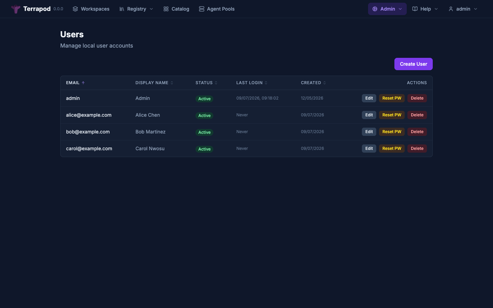
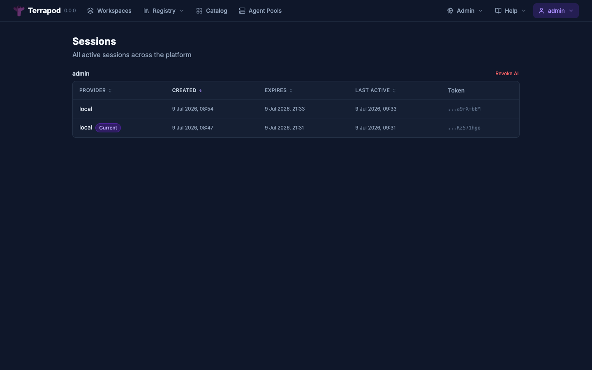

# Authentication

Terrapod supports multiple authentication methods: local passwords, OIDC, SAML, and OAuth2 PKCE for the terraform CLI. This guide covers setup and configuration for each.

---

## Overview

Three authentication methods, evaluated in priority order:

| Type | Storage | Lifetime | Use Case |
|---|---|---|---|
| **Runner Tokens** | Stateless (HMAC-SHA256) | Short-lived (1h default, 2h max) | Runner Jobs (scoped to a single run) |
| **API Tokens** | PostgreSQL (SHA-256 hashed) | Configurable max TTL | terraform CLI, automation |
| **Sessions** | Redis | 12h sliding TTL | Web UI |

The unified auth dependency tries runner tokens first (fast HMAC verification, no I/O), then API tokens (DB lookup), then sessions (Redis lookup). All return the same `AuthenticatedUser` shape to downstream handlers.

---


## Local Password Authentication

Local auth is the simplest authentication method, suitable for development and small deployments.

### Configuration

```yaml
# Helm values
api:
  config:
    auth:
      local_enabled: true
```

Or via environment variable:

```zsh
TERRAPOD_AUTH__LOCAL_ENABLED=true
```

### Bootstrap Admin User

The initial admin user is created by the bootstrap Helm hook:

```yaml
# Helm values
bootstrap:
  adminEmail: admin@example.com
  adminPassword: "a-strong-password"
```

Or reference an existing Kubernetes Secret:

```yaml
bootstrap:
  existingSecret: terrapod-admin-credentials
  emailKey: email
  passwordKey: password
```

Users can be managed from the admin panel at **Admin > Users**.



### Password Requirements

Passwords are hashed with PBKDF2-SHA256 and validated with [zxcvbn](https://github.com/dropbox/zxcvbn) for strength. Weak passwords are rejected at creation time.

### Login Flow

```
POST /api/terrapod/v1/auth/local/authorize
  email=admin@example.com
  password=xxx
    |
    v
Verify PBKDF2-SHA256 hash
    |
    v
Create session in Redis (tp:session:{token}, 12h sliding TTL)
    |
    v
Return session token + redirect URL
```

---

## OIDC Authentication

Terrapod uses [authlib](https://authlib.org/) for OIDC integration. Any standards-compliant OIDC provider works.

Terrapod sends **S256 PKCE** ([RFC 7636](https://www.rfc-editor.org/rfc/rfc7636)) on the upstream authorization request and token exchange, in addition to the client secret. No configuration is required — it is always on, and providers that don't enforce PKCE simply ignore the extra parameters. This makes Terrapod compatible with IdPs that require PKCE on the authorization-code flow even when a client secret is configured (e.g. Pinniped Supervisor).

### Auth0 Example

```yaml
api:
  config:
    auth:
      callback_base_url: "https://terrapod.example.com"
      sso:
        default_provider: auth0
        oidc:
          - name: auth0
            display_name: "Auth0 SSO"
            issuer_url: "https://your-tenant.auth0.com/"
            client_id: "your-client-id"
            scopes: ["openid", "profile", "email"]
            groups_claim: "https://your-tenant.auth0.com/groups"
            role_prefixes: ["terrapod:", "terrapod-"]
            claims_to_roles:
              - claim: "https://your-tenant.auth0.com/groups"
                value: "platform-admins"
                roles: ["admin"]
```

Inject the client secret via environment variable:

```zsh
TERRAPOD_AUTH0_CLIENT_SECRET="your-client-secret"
```

The environment variable name follows the pattern `TERRAPOD_{UPPERCASE_NAME}_CLIENT_SECRET`.

**Auth0 Application Settings:**

| Setting | Value |
|---|---|
| Application Type | Regular Web Application |
| Allowed Callback URLs | `https://terrapod.example.com/api/terrapod/v1/auth/callback` |
| Allowed Logout URLs | `https://terrapod.example.com` |

### Okta Example

```yaml
api:
  config:
    auth:
      callback_base_url: "https://terrapod.example.com"
      sso:
        default_provider: okta
        oidc:
          - name: okta
            display_name: "Okta SSO"
            issuer_url: "https://your-org.okta.com/oauth2/default"
            client_id: "your-client-id"
            scopes: ["openid", "profile", "email", "groups"]
            groups_claim: "groups"
            role_prefixes: ["terrapod:"]
            claims_to_roles:
              - claim: groups
                value: "TerrapodAdmins"
                roles: ["admin"]
```

```zsh
TERRAPOD_OKTA_CLIENT_SECRET="your-client-secret"
```

**Okta Application Settings:**

| Setting | Value |
|---|---|
| Sign-in method | OIDC - OpenID Connect |
| Application type | Web Application |
| Sign-in redirect URI | `https://terrapod.example.com/api/terrapod/v1/auth/callback` |
| Assignments | Assign to users/groups as needed |

### Azure AD (Entra ID) Example

```yaml
api:
  config:
    auth:
      callback_base_url: "https://terrapod.example.com"
      sso:
        default_provider: azure-ad
        oidc:
          - name: azure-ad
            display_name: "Microsoft SSO"
            issuer_url: "https://login.microsoftonline.com/{tenant-id}/v2.0"
            client_id: "your-application-id"
            scopes: ["openid", "profile", "email"]
            groups_claim: "groups"
            role_prefixes: ["terrapod:"]
```

```zsh
TERRAPOD_AZURE_AD_CLIENT_SECRET="your-client-secret"
```

**Azure AD App Registration:**

| Setting | Value |
|---|---|
| Redirect URI | `https://terrapod.example.com/api/terrapod/v1/auth/callback` (Web platform) |
| Token configuration | Add optional claim: `groups` |
| API permissions | `openid`, `profile`, `email` |

### Role Resolution from OIDC

When a user logs in via OIDC, roles are resolved from three sources (merged and deduplicated):

1. **IDP groups** -- group names from the `groups_claim`, with `role_prefixes` stripped. For example, if the IDP returns `terrapod:developer` and the prefix is `terrapod:`, the role `developer` is assigned.

2. **Claims-to-roles mapping** -- explicit rules in the config. Each rule matches a claim name + value and assigns specific roles.

3. **Internal role assignments** -- roles assigned via the `role_assignments` table (managed through the admin API or UI).

### Multiple OIDC Providers

You can configure multiple OIDC providers simultaneously:

```yaml
sso:
  default_provider: okta
  oidc:
    - name: okta
      issuer_url: "https://your-org.okta.com/oauth2/default"
      client_id: "..."
    - name: auth0
      issuer_url: "https://your-tenant.auth0.com/"
      client_id: "..."
```

The login page shows buttons for each configured provider.

---

## SAML Authentication

Terrapod uses [python3-saml](https://github.com/SAML-Toolkits/python3-saml) for SAML 2.0 integration.

### Azure AD SAML Example

```yaml
api:
  config:
    auth:
      callback_base_url: "https://terrapod.example.com"
      sso:
        saml:
          - name: azure-ad-saml
            display_name: "Azure AD (SAML)"
            metadata_url: "https://login.microsoftonline.com/{tenant-id}/federationmetadata/2007-06/federationmetadata.xml?appid={app-id}"
            entity_id: "https://terrapod.example.com"
            acs_url: "https://terrapod.example.com/api/terrapod/v1/auth/callback"
            role_prefixes: ["terrapod:"]
            claims_to_roles:
              - claim: "http://schemas.microsoft.com/ws/2008/06/identity/claims/groups"
                value: "{group-object-id}"
                roles: ["admin"]
```

**Azure AD Enterprise Application:**

| Setting | Value |
|---|---|
| Identifier (Entity ID) | `https://terrapod.example.com` |
| Reply URL (ACS URL) | `https://terrapod.example.com/api/terrapod/v1/auth/callback` |
| Sign on URL | `https://terrapod.example.com/login` |
| Claims | Name ID (email), groups |

Note: The API Docker image includes `xmlsec1` which is required for SAML signature verification.

---

## Terraform Login Flow (OAuth2 PKCE)

The `terraform login` command uses OAuth2 Authorization Code with PKCE to obtain an API token.

### How It Works

1. Run `terraform login terrapod.local` (or `tofu login terrapod.local`)
2. Terraform fetches `/.well-known/terraform.json` for service discovery
3. A browser window opens to `/oauth/authorize` with a PKCE challenge
4. The user authenticates with their configured identity provider
5. After successful auth, the API generates a one-time authorization code
6. Terraform exchanges the code for an API token via `POST /oauth/token`
7. The token is stored in `~/.terraform.d/credentials.tfrc.json`

The token minted by `terraform login` is **short-lived** — its lifespan is `auth.login_token_ttl_hours` (default **12 hours**), so it expires at the end of a working session rather than living for the full `api_token_max_ttl_hours` cap. Re-run `terraform login` to get a fresh one. For long-lived automation, create a dedicated token (a [service token](#token-kinds--personal-vs-service-tokens) for scoped/M2M use) rather than relying on a login token.

### Prerequisites

The `callback_base_url` must be set to the externally-reachable URL of the Terrapod instance:

```yaml
api:
  config:
    auth:
      callback_base_url: "https://terrapod.example.com"
```

At least one SSO provider must be configured (OIDC or SAML), or local auth must be enabled.

### Usage

```zsh
# Login
terraform login terrapod.local

# Verify
terraform providers
# or
curl -s https://terrapod.local/api/v2/account/details \
  -H "Authorization: Bearer $(jq -r '.credentials["terrapod.local"].token' ~/.terraform.d/credentials.tfrc.json)"
```

### OpenTofu Compatibility

`tofu login` works identically:

```zsh
tofu login terrapod.local
```

Credentials are stored in `~/.terraform.d/credentials.tfrc.json` (shared location).

---

## API Tokens

API tokens are long-lived credentials for automation, CI/CD pipelines, and the terraform CLI.

### Token Format

```
{random_id}.tpod.{random_secret}
```

Example: `abc123def456.tpod.ghijklmnopqrstuvwxyz0123456789`

### Security Properties

- SHA-256 hashed at rest in the `api_tokens` PostgreSQL table
- The raw token value is returned only once at creation time
- Max lifetime enforced via `auth.api_token_max_ttl_hours` config
- Changing the max TTL retroactively affects all existing tokens

### Token Kinds — Personal vs Service Tokens

Every token has a **kind** that determines how its permissions are resolved:

| Kind | Who can create | Effective permissions | Bound to | Best for |
|---|---|---|---|---|
| **`interactive`** (default) | anyone | the owner's full live roles | the owner | a person's CLI / `terraform login` token |
| **`service_bound`** | anyone | the **intersection** of the token's pinned roles and the owner's live roles, resolved per resource | the owner | scoped automation that should never outlive the person who made it |
| **`service_detached`** | **admins only** | the token's pinned roles as an **absolute** scope | nobody (unbound) | critical machine-to-machine automation that must survive any one person leaving |

The intersection for `service_bound` is the key safety property: you can pin a token to a subset of your roles, but it can never grant more than you currently have. Pick the pinned roles from your own roles in the create form; the UI filters to exactly that set.

`service_detached` tokens are the supported path for long-lived, business-critical automation. Because they are unbound and admin-managed, they don't break when an individual is offboarded — but they also don't inherit anyone's live permissions, so their pinned scope is the whole story. Keep it minimal.

#### Offboarding safety — the idle-login guard

A **`service_bound`** (or `interactive`) token is **rejected if its owner hasn't successfully logged in within `auth.bound_token_idle_days`** (default 7). Terrapod records the last successful login per user in Redis (`tp:user_seen:{email}`); once that window lapses, every token bound to the user stops authenticating until they log in again.

This means a user who is cut off from SSO (account disabled at the IdP) automatically loses their bound tokens within a week — without any cleanup action — closing the "ex-employee's CI token still works weeks later" gap. For an **immediate** cut-off, use the [revoke-all offboarding runbook](runbooks.md). Critical M2M automation should use **`service_detached`** tokens (admin-managed, exempt from the idle guard) so it isn't affected by any individual's login activity.

```yaml
api:
  config:
    auth:
      bound_token_idle_days: 7            # reject bound tokens after this idle window (0 = disabled)
      service_token_max_ttl_hours: 8760   # hard cap on service-token lifespan (always expires)
      token_expiry_warning_days: 14       # in-app expiry banner lead time
```

### Rotating a Service Token

Rotate a token to swap its secret without re-wiring its identity or scope:

```zsh
curl -X POST https://terrapod.example.com/api/terrapod/v1/authentication-tokens/{token-id}/actions/rotate \
  -H "Authorization: Bearer $TERRAPOD_TOKEN"
```

The response carries the new secret in `attributes.token` (shown once); the old secret stops working immediately and the expiry clock resets. In the UI this is the **Rotate** action on each service token.

### Creating Tokens via API

```zsh
curl -X POST https://terrapod.example.com/api/terrapod/v1/users/{user_id}/authentication-tokens \
  -H "Authorization: Bearer $TERRAPOD_TOKEN" \
  -H "Content-Type: application/vnd.api+json" \
  -d '{
    "data": {
      "type": "authentication-tokens",
      "attributes": {
        "description": "CI/CD pipeline token"
      }
    }
  }'
```

The response includes the raw token value in `attributes.token`. Store it securely -- it cannot be retrieved again.

To create a **detached** service token (admin only) scoped to specific roles:

```zsh
curl -X POST https://terrapod.example.com/api/terrapod/v1/users/{admin_user}/authentication-tokens \
  -H "Authorization: Bearer $TERRAPOD_TOKEN" \
  -H "Content-Type: application/vnd.api+json" \
  -d '{
    "data": {
      "type": "authentication-tokens",
      "attributes": {
        "description": "prod deploy pipeline",
        "kind": "service_detached",
        "pinned_roles": ["prod-deployer"]
      }
    }
  }'
```

The token comes back with `"bound-to": null` and the pinned roles as its absolute scope. For a `service_bound` token, set `"kind": "service_bound"` and pick `pinned_roles` from your own roles (the effective scope is the intersection with your live access).

### Creating Tokens via Web UI

1. Navigate to **Settings > API Tokens**
2. Click **Create Token**
3. Enter a description
4. Copy the token value immediately


### Listing Tokens

List your own tokens:

```zsh
curl https://terrapod.example.com/api/terrapod/v1/users/{user_id}/authentication-tokens \
  -H "Authorization: Bearer $TERRAPOD_TOKEN"
```

Admins can list all tokens across users (optionally filtered by `?kind=`):

```zsh
curl https://terrapod.example.com/api/terrapod/v1/admin/authentication-tokens \
  -H "Authorization: Bearer $TERRAPOD_TOKEN"
```

### Deleting Tokens

```zsh
curl -X DELETE https://terrapod.example.com/api/terrapod/v1/authentication-tokens/{token-id} \
  -H "Authorization: Bearer $TERRAPOD_TOKEN"
```

### Token Lifespan Configuration

```yaml
api:
  config:
    auth:
      api_token_max_ttl_hours: 8760  # upper bound on ANY token. 1 year default; 0 = no limit
      login_token_ttl_hours: 12      # lifespan of `terraform login` tokens; 0 = fall back to the cap
```

- **`api_token_max_ttl_hours`** is the hard *cap* — the maximum lifetime any token may have. It's computed at validation time as `(rotated_at or created_at) + max_ttl`, so changing it retroactively re-dates every existing token. `0` removes the cap.
- **`login_token_ttl_hours`** is the *actual* lifespan handed to the short-lived token that `terraform login` mints (default 12h). It's clamped to the cap. Set `0` to give login tokens no explicit lifespan (they then fall back to the cap — the old behaviour).

A token created with an explicit `lifespan_hours` (e.g. via the API or the create form) expires at `created_at + min(lifespan_hours, cap)`; one created without (a bare `terraform login` before this setting existed) expires at the cap.

---

## Session Management

### Session Properties

| Property | Value |
|---|---|
| Storage | Redis (`tp:session:{token}`) |
| TTL | 12 hours (sliding -- refreshed on activity, rate-limited to once per 5 minutes) |
| Scope | Web UI only |

### Configuration

```yaml
api:
  config:
    auth:
      session_ttl_hours: 12
```

### Viewing Active Sessions

Via the web UI: **Settings > Sessions**



Via the API:

```zsh
curl https://terrapod.example.com/api/terrapod/v1/auth/sessions \
  -H "Authorization: Bearer $TERRAPOD_TOKEN"
```

### Logging Out

```zsh
curl -X POST https://terrapod.example.com/api/terrapod/v1/auth/logout \
  -H "Authorization: Bearer $TERRAPOD_TOKEN"
```

This deletes the session from Redis immediately.

---

## Requiring External SSO for Specific Roles

You can require that certain roles can only be assigned via external SSO providers (not local auth):

```yaml
api:
  config:
    auth:
      require_external_sso_for_roles:
        - admin
```

This prevents the `admin` role from being granted to users who authenticate via local password.

---

## Redis Key Reference

| Key Pattern | Purpose | TTL |
|---|---|---|
| `tp:session:{token}` | Session data (user info, roles) | 12h sliding |
| `tp:user_sessions:{email}` | Set of session tokens per user | 12h |
| `tp:auth_state:{state}` | OAuth2/SAML auth state (authorize to callback) | 5 min |
| `tp:auth_code:{code}` | One-time auth code (callback to token exchange) | 60 sec |
| `tp:recent_user:{provider}:{email}` | Recent user tracking for admin UX | 7 days |
| `tp:token_roles:{email}` | Cached roles for API token auth | 60 sec |
