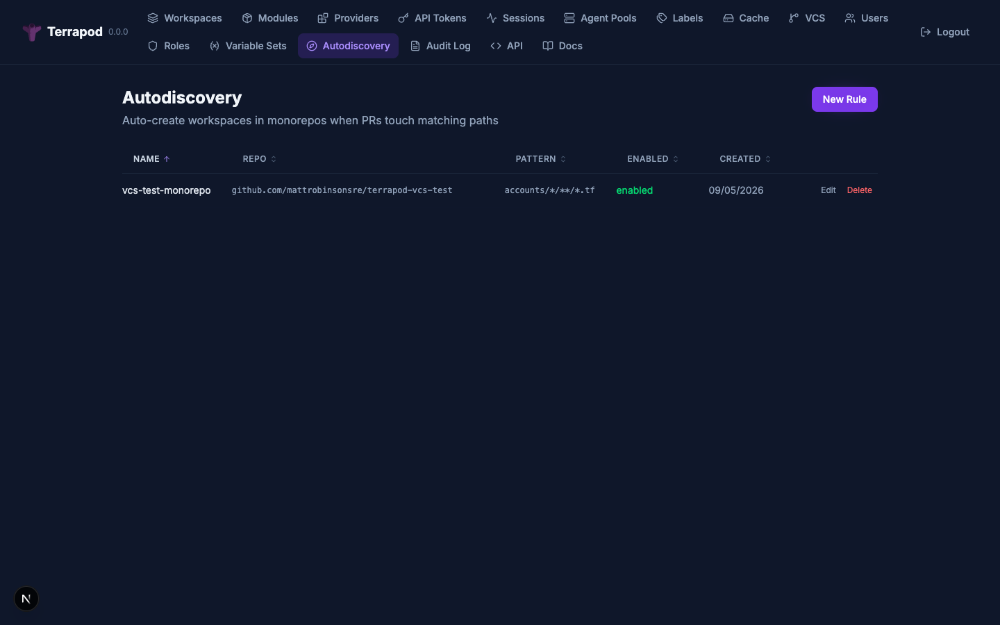

# Workspace Autodiscovery

Modelled on [Atlantis's `autodiscover`](https://www.runatlantis.io/docs/server-side-repo-config.html#autodiscover) feature, autodiscovery auto-creates a Terrapod workspace the first time a PR (or default-branch push) touches a path matching one of your rules. Designed for monorepos where pre-provisioning a workspace per directory is impractical.



## When you'd want this

- A monorepo with hundreds of nested terraform root modules (one per AWS account, one per environment, etc.).
- New roots are added regularly via PRs, and you don't want every PR-author to also have to create a Terrapod workspace.
- You're happy giving every discovered directory the *same* execution defaults — agent pool, terraform version, resource requests, default labels, owner.

## When you wouldn't

- You only have a handful of long-lived workspaces. Just create them.
- Different directories need different workspace configuration that can't be expressed by a single rule.

## How it works

```
┌─────────────────┐       ┌──────────────────────┐       ┌─────────────────────┐
│ PR opened       │  PR's │ Poller scans changed │ Match │ Workspace created   │
│ on branch X     ├──────►│ files vs rules       ├──────►│ with rule's         │
│                 │ files │ (pattern + ignore)   │       │ template defaults   │
└─────────────────┘       └──────────────────────┘       └─────────────────────┘
                                                                    │
                                                                    ▼
                                                         ┌─────────────────────┐
                                                         │ Next poll cycle     │
                                                         │ runs the speculative│
                                                         │ plan as normal      │
                                                         └─────────────────────┘
```

Autodiscovery runs on every poll cycle (default 60s) and on every webhook-triggered immediate poll for the matching repo. It only creates workspaces — the existing PR/branch poll logic queues the speculative plan on the next pass.

## GitHub App permissions

**No new permissions required.** The same `Contents: read`, `Pull requests: read & write`, and `Metadata: read` you've already granted for VCS integration cover autodiscovery (file listing on PRs uses `Pull requests: read`). Existing GitLab access tokens with `read_api` + `read_repository` (or `api`) work without changes.

## Rule schema

Rules are scoped to a single VCS connection + repo. A rule has:

| Field | Type | Required | Description |
|---|---|---|---|
| `name` | string | yes | Display name for the rule. Unique per VCS connection. |
| `vcs-connection-id` | UUID | yes | Reference to an existing VCS connection. |
| `repo-url` | string | yes | Full repo URL, e.g. `https://github.com/myorg/monorepo`. |
| `branch` | string | no | Branch the rule scopes to. Empty = default branch. |
| `pattern` | string | yes | Glob matched against changed file paths (gitignore-style with `**` support). |
| `ignore-patterns` | string[] | no | Globs filtered out before pattern matching. |
| `name-template` | string | no | Template for derived workspace names. Default: directory path with `/` replaced by `-`. |
| `enabled` | bool | no | Default `true`. |
| `execution-mode` | enum | no | Must be `agent` (default). Autodiscovery is VCS-driven; `local` mode would create workspaces with queued runs and no executor. |
| `agent-pool-id` | UUID | no | Inherited by created workspaces in `agent` mode. |
| `execution-backend` | enum | no | `tofu` or `terraform`. Default `tofu`. |
| `terraform-version` | string | no | Default `1.12`. |
| `resource-cpu` / `resource-memory` | string | no | Defaults `1` / `2Gi`. |
| `auto-apply` | bool | no | Default `false`. |
| `on-directory-delete` | enum | no | `flag` (default — mark `pending_deletion`, require explicit operator action) or `destroy` (opt-in — real destroy run then archive). See the Lifecycle section (#314). |
| `labels` | map | no | Inherited by created workspaces — feeds Terrapod's label-based RBAC and filtering. Reserved keys (`status`, `pool`, `mode`, `backend`, `owner`, `drift`, `version`, `vcs`, `locked`, `branch`) are rejected with `422` at rule create/update — they are virtual filter terms and would otherwise produce workspaces that can't be saved. |
| `owner-email` | string | no | Inherited by created workspaces; if unset, created workspaces have no owner and label-RBAC alone determines access. |
| `var-files` | list | no | Var-file paths set on every created workspace. |
| `run-task-templates` | list | no | Run-task specs (`{name, url, hmac-key?, stage, enforcement-level?, enabled?}`) materialised onto every created workspace — same shape as the bulk-update `run-tasks`. Define a policy gate once; it auto-applies to all future workspaces (#318). |
| `notification-templates` | list | no | Notification specs (`{name, destination-type, url?, token?, triggers?, email-addresses?, enabled?}`) materialised onto every created workspace. |
| `execution-hook-templates` | list | no | [Execution hook](execution-hooks.md) ids (`hook-<uuid>`) associated with every created workspace, so discovered workspaces inherit their hooks automatically (#672). Ids that no longer exist are skipped at creation. |

## Pattern syntax

Rules use gitignore-style globs. Patterns are matched against the **full file path** (e.g. `accounts/alpha/network/main.tf`).

| Token | Meaning |
|---|---|
| `*` | match anything within a single path segment (no `/`) |
| `**` | match zero or more path segments |
| `?` | match a single non-`/` character |
| `[abc]` | match one of `a`, `b`, `c`; `[!abc]` = NOT one of those |

Only terraform configuration files (`*.tf`, `*.tfvars`, `*.tf.json`, `*.tfvars.json`, `*.hcl`) trigger autodiscovery. README/CI/script changes are filtered out before pattern matching.

## How the workspace is named

The created workspace's `working-directory` is the directory containing the matched terraform file. The default name is that directory with `/` replaced by `-`:

```
accounts/alpha/network/main.tf  →  workspace `accounts-alpha-network` (working_directory = `accounts/alpha/network`)
```

If the default would collide with an existing unrelated workspace, Terrapod logs a warning and skips creation. Tighten `name-template` to disambiguate:

```
name-template: "monorepo-{path}"   →  monorepo-accounts-alpha-network
name-template: "ws-{root}"         →  ws-accounts-alpha-network  ({root} preserves /, sanitiser maps to -)
```

`{path}` is the dashed directory; `{root}` is the directory with `/` preserved. Names are sanitised to `[A-Za-z0-9_-]` and capped at 90 chars (the workspaces.name column limit).

## Created workspace properties

A workspace created by a rule:
- Inherits all template fields above.
- Has its `var-files`, plus a `run-task` / `notification-configuration` for each entry in the rule's `run-task-templates` / `notification-templates`, materialised at creation — so the workspace is fully configured with no second pass (#318).
- Has `vcs-connection-id`, `vcs-repo-url`, `vcs-branch` set from the rule.
- Has `working-directory` set to the matched file's parent.
- Has `trigger-prefixes` set to `[working_directory]` so subsequent PRs that touch the same dir route to the same workspace via the regular PR-scan path (not via re-running autodiscovery).
- Tracks `autodiscovery-rule-id` so you can audit which rule created it.
- Is seeded with the **tracked-branch HEAD** as its last-seen commit (`vcs-last-commit-sha`). Autodiscovery is PR-driven — the matched directory exists on the PR branch but not yet on the tracked branch — so without this baseline the next branch poll would fire a full plan+apply against a branch where the directory doesn't exist, which errors. With the baseline, the speculative plan-only run for the open PR still happens, and the first real plan+apply fires when the tracked branch actually advances (typically the PR merge).

If you delete the rule later, existing workspaces keep working — the foreign key sets to NULL on cascade.

## Lifecycle: rename / delete / orphan (#314)

Autodiscovered workspaces are reconciled as the repo evolves. **Safe by default — nothing is destroyed unless a rule explicitly opts in.**

- **Directory renamed** (`git mv old/ new/`): detected from the provider's per-file rename info. On the PR, an informational comment is posted. When the rename reaches the tracked branch the existing workspace is **moved in place** (`working-directory`/`trigger-prefixes`/templated name updated) — **state and history are preserved, nothing is destroyed**. A rename whose files fan out to multiple directories (split/merge) is *ambiguous* — it is **not** auto-applied; the workspace is flagged for a human and the new directories autodiscover normally.
- **Directory deleted**: on the open PR a **speculative `plan -destroy`** is queued and a comment posted so reviewers see the blast radius (no mutation). When the deletion reaches the tracked branch — *and only after re-verifying the directory is actually gone from the tree* — the rule's **`on-directory-delete`** policy applies:
  - `flag` (default, safe): the workspace is marked `pending_deletion` and **requires an explicit operator action**. Never auto-destroyed.
  - `destroy` (opt-in, for ephemeral envs): a real destroy run is queued; on success the workspace is **archived** (soft-deleted, retained for audit). A *failed* destroy is auto-retried a bounded number of times (`runners.lifecycleDestroyRetries`, default 2) — `terraform destroy` is transiently flaky and re-running is safe (incremental) — and the workspace is archived only on a **successful** destroy, so retries never lose data.
- **Origin PR closed unmerged / no longer matching**: the workspace is an orphan (its directory never reached the tracked branch). If it **never applied state** (zero state versions) it is **auto-archived**; if it **has state** it is flagged `pending_deletion` for a human. Never silently destroyed.

`lifecycle-state` (`active` | `pending_deletion` | `archived`) and `lifecycle-reason` are exposed on the workspace and surfaced in the UI. All transitions are audited (`autodiscovery.workspace_moved` / `.pending_deletion` / `.destroy_queued` / `.archived` / `.rename_conflict`).

## Example

A monorepo for ~2000 AWS accounts in this shape:

```
accounts/
  alpha/network/main.tf
  alpha/compute/main.tf
  beta/network/main.tf
  ...
modules/
  vpc/main.tf      # reusable module — NOT a discoverable root
```

Rule:

```yaml
name: monorepo
vcs-connection-id: vcs-019e0e7b-a6de-7ea6-8b27-3a983c0a098e
repo-url: https://github.com/myorg/monorepo
branch: main
pattern: accounts/*/**/*.tf
ignore-patterns:
  - modules/**
execution-mode: agent
agent-pool-id: apool-019e01db-a2a3-7494-afe0-1a8ecf70b3eb
labels:
  managed-by: monorepo-autodiscover
owner-email: platform@example.com
```

Outcome:

| PR change | Result |
|---|---|
| `accounts/alpha/network/main.tf` | Workspace `accounts-alpha-network` auto-created (if it didn't exist) |
| `accounts/gamma/dns/main.tf` | New workspace `accounts-gamma-dns` auto-created |
| `modules/vpc/main.tf` | No workspace created (matches ignore pattern) |
| `README.md` | No workspace created (not a terraform file) |

## API

Admin-only CRUD at `/api/terrapod/v1/autodiscovery-rules`:

```
GET    /api/terrapod/v1/autodiscovery-rules
POST   /api/terrapod/v1/autodiscovery-rules
GET    /api/terrapod/v1/autodiscovery-rules/{id}
PATCH  /api/terrapod/v1/autodiscovery-rules/{id}
DELETE /api/terrapod/v1/autodiscovery-rules/{id}
```

### Preview and on-demand scan

Beyond passively waiting for the poller, you can dry-run a rule and provision on demand:

```
GET  /api/terrapod/v1/autodiscovery-rules/{id}/preview   # what a saved rule would create — no side effects
POST /api/terrapod/v1/autodiscovery-rules/preview        # same, for an unsaved rule (Create body) — iterate before saving
POST /api/terrapod/v1/autodiscovery-rules/{id}/scan      # walk now and actually create the workspaces (idempotent)
```

Preview walks the tracked branch and returns, per directory: `workspace_name`, `working_directory`, `collision` (would no-op — a workspace is already bound to that directory, or the derived name is taken), and `existing_autodiscovered` (the no-op is a reuse of a workspace this same rule already made). The admin UI surfaces this as a per-row badge (Create / Skip already-discovered / Skip name-collision) and a "Provision N workspaces" confirm whose count is exactly the non-colliding rows. A `413` means the provider truncated the repo tree (too large to scan in one pass). `scan` force-enables the rule for the call so an explicit operator action doesn't silently no-op on a disabled rule.

JSON:API request body example:

```json
{
  "data": {
    "type": "autodiscovery-rules",
    "attributes": {
      "name": "monorepo",
      "vcs-connection-id": "vcs-019e0e7b-...",
      "repo-url": "https://github.com/myorg/monorepo",
      "pattern": "accounts/*/**/*.tf",
      "ignore-patterns": ["modules/**"],
      "execution-mode": "agent",
      "agent-pool-id": "apool-019e01db-...",
      "labels": {"managed-by": "monorepo-autodiscover"},
      "owner-email": "platform@example.com"
    }
  }
}
```

## Operational notes

- **Lifecycle of discovered workspaces**: workspaces persist after the source directory is deleted. Operators can archive/delete via the normal workspace API.
- **Race-safety**: idempotent. Concurrent poll cycles trying to create the same workspace fall through to a "found existing" branch.
- **Failure isolation**: a misconfigured rule (bad repo URL, GitHub auth failure, rate limit) is logged and skipped; other rules in the same cycle continue.
- **Observability**: every autodiscovery action emits a structlog entry — grep API logs for `Autodiscovery created workspace` and `Autodiscovery name collision`.

## Related

- Atlantis autodiscover docs: <https://www.runatlantis.io/docs/server-side-repo-config.html#autodiscover>
- Original feature request: <https://github.com/mattrobinsonsre/terrapod/issues/283>
