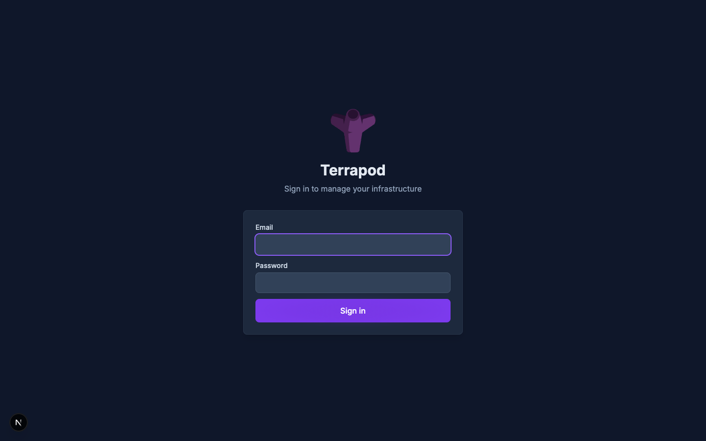
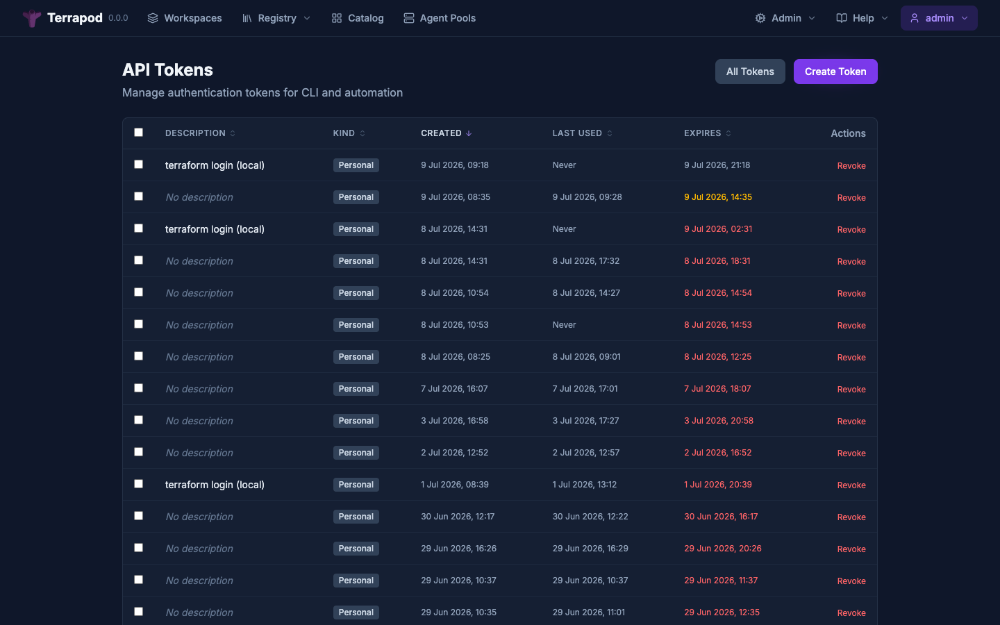
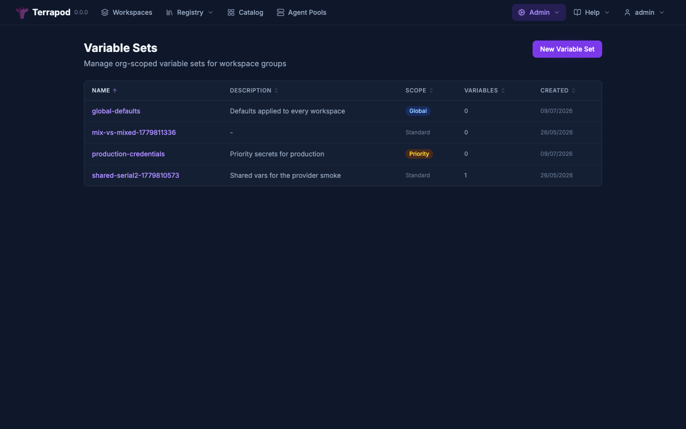

# Getting Started

This guide walks through setting up Terrapod locally, creating your first workspace, and running your first plan and apply against it.

> **OpenTofu is the recommended execution backend.** Terrapod supports both [OpenTofu](https://opentofu.org/) (`tofu`) and Terraform (`terraform`) as execution backends. OpenTofu is recommended because it is open-source under the MPL-2.0 license. All CLI examples in this guide use `tofu`, but `terraform` commands work identically.

---

## Prerequisites

### Required Software

| Tool | Purpose | Install |
|---|---|---|
| Docker | Container runtime | [docker.com](https://www.docker.com/) |
| Kubernetes cluster | Local K8s (any of the below) | See below |
| Tilt | Local K8s dev environment | `brew install tilt` |
| mkcert | Local TLS certificates | `brew install mkcert` |
| tofu (recommended) or terraform | Infrastructure CLI | [opentofu.org](https://opentofu.org/) (recommended) or [terraform.io](https://www.terraform.io/) |

### Supported Local Kubernetes Clusters

Any of these will work:
- [Rancher Desktop](https://rancherdesktop.io/)
- [Docker Desktop](https://www.docker.com/products/docker-desktop/) (with Kubernetes enabled)
- [minikube](https://minikube.sigs.k8s.io/)
- [kind](https://kind.sigs.k8s.io/)
- [OrbStack](https://orbstack.dev/)
- [colima](https://github.com/abiosoft/colima)

---

## Local Development Setup

### Step 1: Install mkcert and create local CA

```zsh
brew install mkcert
mkcert -install
```

This installs a local Certificate Authority into your system trust store so that `https://terrapod.local` is trusted by your browser and the terraform CLI.

### Step 2: Add hosts entry

```zsh
sudo sh -c 'echo "127.0.0.1 terrapod.local" >> /etc/hosts'
```

### Step 3: Start Terrapod

```zsh
make dev
```

This runs `tilt up --port 10352` which:

1. Creates the `terrapod` namespace
2. Generates TLS certificates via mkcert
3. Deploys PostgreSQL and Redis in-cluster
4. Builds the API and web Docker images
5. Runs database migrations (Alembic)
6. Bootstraps the initial admin user
7. Deploys the API server, web UI, and runner listener

Open the Tilt UI at http://localhost:10352 to monitor the deployment.

### Step 4: Access Terrapod

Open https://terrapod.local in your browser.



The bootstrap job creates an initial admin user. The default credentials are `admin` / `admin` (configured in `values-local.yaml`). Check the Tilt logs for the `terrapod-bootstrap-1` resource to confirm.

### Step 5: Get an API Token

After logging in to the web UI, navigate to **Settings > API Tokens** and create a new token. Copy the token value -- it is only shown once.



```zsh
export TERRAPOD_TOKEN="<your-token-value>"
```

Alternatively, use `terraform login`:

```zsh
terraform login terrapod.local
```

This opens a browser window, authenticates via the configured identity provider, and stores the token automatically.

---

## Creating Your First Workspace

### Via the API

```zsh
curl -s -X POST https://terrapod.local/api/v2/organizations/default/workspaces \
  -H "Authorization: Bearer $TERRAPOD_TOKEN" \
  -H "Content-Type: application/vnd.api+json" \
  -d '{
    "data": {
      "type": "workspaces",
      "attributes": {
        "name": "demo",
        "auto-apply": true
      }
    }
  }' | jq .
```

Note the workspace ID from the response (e.g., `ws-abc123...`).

### Via the Web UI

1. Navigate to **Workspaces**
2. Click **New Workspace**
3. Enter a name (e.g., `demo`)
4. Optionally enable auto-apply
5. Click **Create**


---

## Configuring the CLI

Create a configuration that uses Terrapod as its backend:

```hcl
# main.tf
terraform {
  cloud {
    hostname     = "terrapod.local"
    organization = "default"

    workspaces {
      name = "demo"
    }
  }
}

# A simple example resource
resource "null_resource" "hello" {
  triggers = {
    timestamp = timestamp()
  }

  provisioner "local-exec" {
    command = "echo 'Hello from Terrapod!'"
  }
}
```

> Note: The `terraform {}` block syntax is used by both OpenTofu and Terraform. No changes are needed when switching between them.

If you have not already run `tofu login`:

```zsh
tofu login terrapod.local
```

Then initialize:

```zsh
tofu init
```

You should see output confirming that OpenTofu is using Terrapod as its backend:

```
Initializing Terraform Cloud...
...
Terraform Cloud has been successfully initialized!
```

---

## Running Your First Plan

### Local Execution Mode

In local execution mode, `tofu` runs on your machine and pushes state to Terrapod:

```zsh
tofu plan
```

The plan output appears in your terminal as usual. State locking is handled by Terrapod (lock/unlock API calls).

```zsh
tofu apply
```

State is uploaded to Terrapod after a successful apply. You can view state versions in the web UI under the workspace's **State** tab.

### Agent Execution Mode

For agent execution, the runner listener creates a K8s Job that runs tofu (or terraform) on the server via an agent pool.

Agent workspaces support two workflows depending on whether VCS is connected:

**VCS-connected workspaces** — VCS is the source of truth. CLI can only plan; applies must come through VCS.

**Non-VCS workspaces (CLI-driven)** — the CLI is the source of truth. `tofu plan` and `tofu apply` both work, with the apply phase running on the server after plan confirmation.

| Source | VCS-Connected | Non-VCS (CLI-driven) |
|---|---|---|
| `tofu plan` (CLI) | Plan-only on server | Plan-only on server |
| `tofu apply` (CLI) | Blocked (use VCS) | Plan + confirm + apply on server |
| VCS push to tracked branch | Full plan + apply | N/A |
| VCS pull request / merge request | Speculative plan-only | N/A |

1. Set the workspace execution mode to `agent`:

```zsh
curl -X PATCH https://terrapod.local/api/v2/workspaces/ws-{id} \
  -H "Authorization: Bearer $TERRAPOD_TOKEN" \
  -H "Content-Type: application/vnd.api+json" \
  -d '{
    "data": {
      "type": "workspaces",
      "attributes": {
        "execution-mode": "agent"
      }
    }
  }'
```

2. Create a configuration version and upload your code:

```zsh
# Create configuration version
CV_RESPONSE=$(curl -s -X POST https://terrapod.local/api/v2/workspaces/ws-{id}/configuration-versions \
  -H "Authorization: Bearer $TERRAPOD_TOKEN" \
  -H "Content-Type: application/vnd.api+json" \
  -d '{"data": {"type": "configuration-versions", "attributes": {"auto-queue-runs": true}}}')

# Extract upload URL
UPLOAD_URL=$(echo "$CV_RESPONSE" | jq -r '.data.attributes."upload-url"')

# Create tarball and upload
tar -czf config.tar.gz -C /path/to/terraform/dir .
curl -X PUT "$UPLOAD_URL" \
  -H "Content-Type: application/octet-stream" \
  --data-binary @config.tar.gz
```

3. A run is automatically queued (plan-only). Monitor it:

```zsh
curl -s https://terrapod.local/api/v2/workspaces/ws-{id}/runs \
  -H "Authorization: Bearer $TERRAPOD_TOKEN" | jq '.data[0].attributes.status'
```

---

## Setting Up Workspace Variables

Variables can be set per-workspace via the API or web UI.


### Terraform Variables

```zsh
curl -X POST https://terrapod.local/api/v2/workspaces/ws-{id}/vars \
  -H "Authorization: Bearer $TERRAPOD_TOKEN" \
  -H "Content-Type: application/vnd.api+json" \
  -d '{
    "data": {
      "type": "vars",
      "attributes": {
        "key": "instance_type",
        "value": "t3.micro",
        "category": "terraform",
        "sensitive": false,
        "description": "EC2 instance type"
      }
    }
  }'
```

### Environment Variables

```zsh
curl -X POST https://terrapod.local/api/v2/workspaces/ws-{id}/vars \
  -H "Authorization: Bearer $TERRAPOD_TOKEN" \
  -H "Content-Type: application/vnd.api+json" \
  -d '{
    "data": {
      "type": "vars",
      "attributes": {
        "key": "AWS_REGION",
        "value": "eu-west-1",
        "category": "env",
        "sensitive": false
      }
    }
  }'
```

### Sensitive Variables

Set `"sensitive": true` for secrets. The value is protected by database encryption-at-rest and never returned in API responses:

```zsh
curl -X POST https://terrapod.local/api/v2/workspaces/ws-{id}/vars \
  -H "Authorization: Bearer $TERRAPOD_TOKEN" \
  -H "Content-Type: application/vnd.api+json" \
  -d '{
    "data": {
      "type": "vars",
      "attributes": {
        "key": "AWS_SECRET_ACCESS_KEY",
        "value": "wJalrXUtnFEMI/K7MDENG/bPxRfiCYEXAMPLEKEY",
        "category": "env",
        "sensitive": true
      }
    }
  }'
```

Note: Sensitive variables are protected by database encryption-at-rest and never returned in API responses.

For managing variables across multiple workspaces, see variable sets (admin-only) in the web UI under **Admin > Variable Sets**.



---

## Setting Up the Private Registry


### Publishing a Module

1. Create the module:

```zsh
curl -X POST https://terrapod.local/api/v2/organizations/default/registry-modules \
  -H "Authorization: Bearer $TERRAPOD_TOKEN" \
  -H "Content-Type: application/vnd.api+json" \
  -d '{
    "data": {
      "type": "registry-modules",
      "attributes": {
        "name": "vpc",
        "provider": "aws"
      }
    }
  }'
```

2. Create a version:

```zsh
curl -X POST https://terrapod.local/api/v2/organizations/default/registry-modules/private/default/vpc/aws/versions \
  -H "Authorization: Bearer $TERRAPOD_TOKEN" \
  -H "Content-Type: application/vnd.api+json" \
  -d '{
    "data": {
      "type": "registry-module-versions",
      "attributes": {
        "version": "1.0.0"
      }
    }
  }'
```

3. Upload the module tarball using the presigned URL from the response.

4. Use the module in Terraform:

```hcl
module "vpc" {
  source  = "terrapod.local/default/vpc/aws"
  version = "1.0.0"
}
```

For full registry documentation, see [registry.md](registry.md).

---

## Connecting to VCS

To automatically trigger runs when you push to a Git repository:

1. Create a VCS connection (GitHub or GitLab)
2. Link a workspace to a repository

See [vcs-integration.md](vcs-integration.md) for detailed setup instructions.

---

## Running Tests and Linting

All tests run in Docker -- no local Python or Node.js install needed:

```zsh
make test         # Run pytest with LocalStack for S3 testing
make lint         # Run ruff check + format check + mypy
make test-down    # Tear down test containers
```

---

## Stopping the Dev Environment

```zsh
make dev-down
```

This stops all Tilt-managed resources and cleans up the namespace.

---

## Next Steps

- [Authentication](authentication.md) -- configure OIDC/SAML identity providers
- [RBAC](rbac.md) -- set up roles and permissions
- [Drift Detection](drift-detection.md) -- enable scheduled infrastructure drift checks
- [Notifications](notifications.md) -- set up Slack, webhook, or email alerts on run events
- [Run Triggers](run-triggers.md) -- create cross-workspace dependency chains
- [Run Tasks](run-tasks.md) -- add pre/post-plan validation webhooks
- [Deployment](deployment.md) -- deploy to production
- [API Reference](api-reference.md) -- full API documentation
