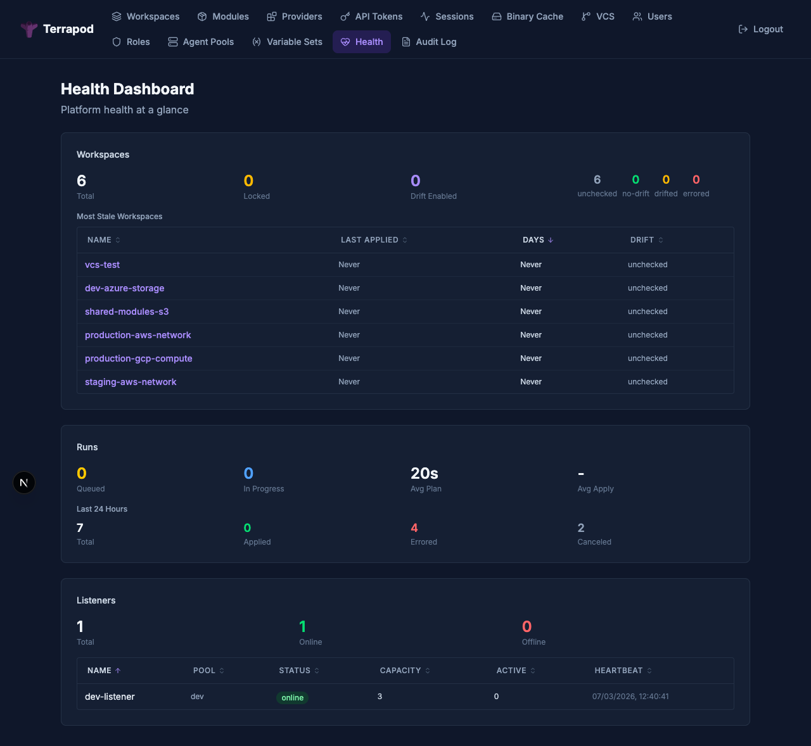

# Health Dashboard

The health dashboard provides an operational overview of workspace health, drift status, run metrics, and runner listener availability. It is available to users with the `admin` or `audit` role.



---

## API

```
GET /api/v2/admin/health-dashboard
```

Requires `admin` or `audit` role.

### Response

```json
{
  "data": {
    "id": "health-dashboard",
    "type": "health-dashboards",
    "attributes": {
      "workspaces": {
        "total": 50,
        "locked": 2,
        "drift-enabled": 15,
        "by-drift-status": {
          "unchecked": 5,
          "no-drift": 7,
          "drifted": 2,
          "errored": 1
        },
        "stale": [
          {
            "id": "ws-uuid",
            "name": "prod-infrastructure",
            "last-applied-at": "2025-02-15T10:30:00Z",
            "days-since-apply": 18,
            "drift-status": "drifted"
          }
        ]
      },
      "runs": {
        "queued": 3,
        "in-progress": 1,
        "recent-24h": {
          "total": 42,
          "applied": 35,
          "errored": 5,
          "canceled": 2
        },
        "average-plan-duration-seconds": 45,
        "average-apply-duration-seconds": 120
      },
      "listeners": {
        "total": 3,
        "online": 2,
        "offline": 1,
        "details": [
          {
            "id": "listener-uuid",
            "name": "pool-listener-pod-abc",
            "pool-name": "default",
            "status": "online",
            "capacity": 5,
            "active-runs": 1,
            "last-heartbeat": "2025-03-09T12:00:00Z"
          }
        ]
      }
    }
  }
}
```

### Data Points

**Workspaces:**

| Metric | Description |
|---|---|
| `workspaces.total` | Total number of workspaces |
| `workspaces.locked` | Workspaces currently locked |
| `workspaces.drift-enabled` | Workspaces with drift detection enabled |
| `workspaces.by-drift-status` | Breakdown of workspaces by drift status |
| `workspaces.stale` | Top 20 workspaces sorted by days since last apply (never-applied appear first) |

**Runs:**

| Metric | Description |
|---|---|
| `runs.queued` | Number of runs currently in the queue |
| `runs.in-progress` | Number of runs currently planning or applying |
| `runs.recent-24h` | Breakdown of runs in the last 24 hours (total, applied, errored, canceled) |
| `runs.average-plan-duration-seconds` | Average plan duration in the last 24 hours |
| `runs.average-apply-duration-seconds` | Average apply duration in the last 24 hours |

**Listeners:**

| Metric | Description |
|---|---|
| `listeners.total` | Total registered listeners |
| `listeners.online` | Listeners with active heartbeats |
| `listeners.offline` | Listeners with expired heartbeats |
| `listeners.details` | Per-listener status including pool, capacity, and active runs |

---

## Drift Status Aggregation

The dashboard groups all workspaces by their `drift_status` value:

| Status | Meaning |
|---|---|
| `unchecked` | Drift detection enabled but no check has run |
| `no-drift` | Latest drift check found no changes |
| `drifted` | Latest drift check detected infrastructure changes |
| `errored` | Latest drift check failed |

See [Drift Detection](drift-detection.md) for details on how drift status is determined.

---

## Staleness

A workspace is considered stale based on how long ago its last successful apply was. The dashboard returns the top 20 stalest workspaces, sorted by `days-since-apply` descending. Workspaces that have never been applied (null `last-applied-at`) appear first.

---

## Real-Time Updates

The health dashboard page receives real-time updates via Server-Sent Events (SSE):

```
GET /api/v2/admin/health-dashboard/events
```

Requires `admin` or `audit` role. The stream emits events when workspace or run health data changes, allowing the dashboard to refresh automatically. See [Architecture — Real-Time Updates](architecture.md#real-time-updates-sse--polling) for details on the SSE implementation.

---

## See Also

- [Drift Detection](drift-detection.md) — how drift status is tracked
- [RBAC](rbac.md) — `admin` and `audit` role requirements
- [API Reference](api-reference.md) — full endpoint documentation
