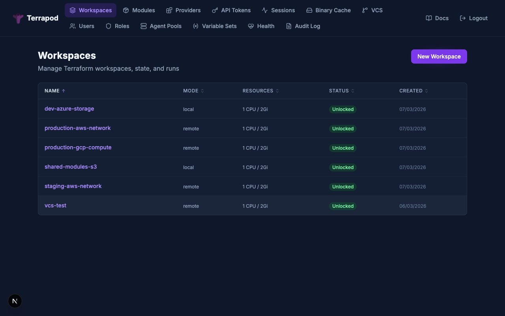

# Terrapod

**Open-source platform replacement for Terraform Enterprise.**

Terrapod provides the collaboration, governance, state management, and UI layer that wraps around `terraform` or `tofu` as pluggable execution backends. It targets API compatibility with the [HCP Terraform / TFE V2 API](https://developer.hashicorp.com/terraform/enterprise/api-docs) so that existing tooling -- the `terraform` CLI with `cloud` block, the [`go-tfe`](https://pkg.go.dev/github.com/hashicorp/go-tfe) client, CI/CD integrations -- can point at a Terrapod instance with minimal reconfiguration.

Terrapod is **not** a fork of Terraform or OpenTofu. It orchestrates them.



---

## Features

| Feature | Description |
|---|---|
| **Workspaces** | Isolate state, variables, and runs per workspace |
| **Remote State Management** | Versioned state storage with locking, rollback, encryption at rest via CSP services |
| **Remote Execution** | Plan/apply runs on the server via K8s Job-based runner infrastructure |
| **VCS Integration** | GitHub (App) and GitLab (access token); polling-first with optional webhooks |
| **Variables & Secrets** | Per-workspace env and Terraform variables; sensitive values protected by database encryption-at-rest; variable sets |
| **RBAC** | Label-based role system with hierarchical workspace permissions (read/plan/write/admin) |
| **Private Registry** | Publish, version, and share modules and providers internally with pull-through caching |
| **Agent Pools** | Named groups of runner listeners; join token → certificate exchange for auth |
| **SSO (OIDC / SAML)** | Pluggable identity providers (Auth0, Okta, Azure AD, etc.) |
| **Run Triggers** | Cross-workspace dependency chains -- source apply triggers downstream runs |
| **Audit Logging** | Immutable event log with configurable retention |
| **Notifications** | Webhook (HMAC-SHA512), Slack (Block Kit), and email alerts on run events |
| **Run Tasks** | Pre/post-plan webhook hooks for external validation |
| **Drift Detection** | Scheduled plan-only runs to detect out-of-band infrastructure changes |
| **Health Dashboard** | Workspace health scores, drift status, run metrics, listener availability |
| **Cloud Credentials** | Dynamic provider credentials via Kubernetes workload identity (AWS IRSA, GCP WIF, Azure WI) |
| **Binary Caching** | Pull-through cache for terraform/tofu CLI binaries |

---

## Quick Start

```zsh
# Prerequisites: Docker, local K8s cluster, Tilt, mkcert
brew install mkcert && mkcert -install
sudo sh -c 'echo "127.0.0.1 terrapod.local" >> /etc/hosts'
make dev
```

Open `https://terrapod.local` in your browser. See [Getting Started](getting-started.md) for the full walkthrough.

---

## Architecture

```
Browser / CLI  ──▶  Ingress  ──▶  Next.js (BFF)  ──▶  FastAPI API
                                                          │
                            ┌──────────┬──────────┬───────┘
                            ▼          ▼          ▼
                       PostgreSQL    Redis    Object Storage
                                                  ▲
                              Runner Listener ────┘
                                    │
                              K8s Jobs (terraform/tofu)
```

- **API-first** -- every UI action is backed by a public API endpoint
- **BFF pattern** -- Next.js is the single ingress entry point; browser never talks to the API directly
- **Kubernetes-native** -- deployed exclusively via Helm chart
- **ARC-pattern execution** -- listener creates ephemeral K8s Jobs on demand

See [Architecture](architecture.md) for the full breakdown.

---

## Documentation

| Guide | Description |
|---|---|
| [Getting Started](getting-started.md) | Local development setup, first workspace, first plan/apply |
| [Architecture](architecture.md) | System components, storage, runners, auth flows |
| [Authentication](authentication.md) | Local auth, OIDC, SAML, terraform login, API tokens |
| [RBAC](rbac.md) | Permission model, label-based access control, custom roles |
| [VCS Integration](vcs-integration.md) | GitHub and GitLab setup, polling, webhooks |
| [Drift Detection](drift-detection.md) | Scheduled plan-only runs to detect infrastructure drift |
| [Run Triggers](run-triggers.md) | Cross-workspace dependency chains |
| [Notifications](notifications.md) | Webhook, Slack, and email alerts on run events |
| [Run Tasks](run-tasks.md) | Pre/post-plan webhook hooks for external validation |
| [Audit Logging](audit-logging.md) | Immutable event log, query API, retention |
| [Health Dashboard](health-dashboard.md) | Workspace health, drift status, run metrics |
| [Cloud Credentials](cloud-credentials.md) | AWS IRSA, GCP WIF, Azure WI setup |
| [Registry](registry.md) | Private module/provider registry, caching layers |
| [Deployment](deployment.md) | Production Helm deployment, storage backends, scaling |
| [API Reference](api-reference.md) | All API endpoints with examples |

---

## License

[GPLv3](https://github.com/mattrobinsonsre/terrapod/blob/main/LICENSE) -- strong copyleft ensures Terrapod and all derivative works remain open source.
