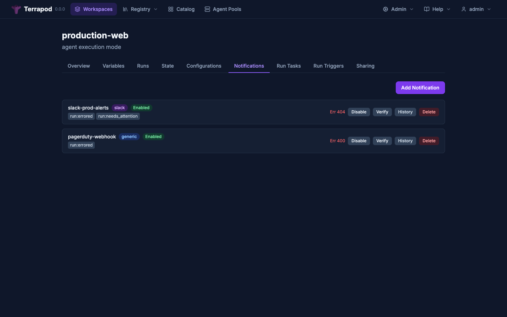

# Notifications

Terrapod sends notifications on run lifecycle events via webhooks, Slack, or email. Notifications are workspace-scoped — each workspace can have multiple notification configurations, each with its own destination and trigger set.



---

## Notification Types

### Generic Webhook

HTTP POST to a custom URL. Optionally signed with HMAC-SHA512 for payload verification.

- **Required**: `url`
- **Optional**: `token` (used as HMAC-SHA512 signing key)
- **Header**: `X-TFE-Notification-Signature` (hex-encoded HMAC digest, present when token is set)

### Slack

HTTP POST to a Slack incoming webhook URL with Block Kit formatting. No token needed — standard Slack webhooks handle authentication via the URL itself.

- **Required**: `url` (Slack webhook URL)

### Email

SMTP email delivery to one or more addresses.

- **Required**: `email-addresses` (list of recipient addresses)
- **Requires**: SMTP server configured in platform settings (`notifications.smtp`)

---

## Supported Triggers

| Trigger | Description |
|---|---|
| `run:created` | Run enters pending state |
| `run:planning` | Run transitions to planning |
| `run:needs_attention` | Run requires user action |
| `run:planned` | Run reaches planned state |
| `run:applying` | Run transitions to applying |
| `run:completed` | Run reaches applied (success) state |
| `run:errored` | Run enters errored state |
| `run:drift_detected` | Infrastructure drift detected by a [drift detection](drift-detection.md) run |

Each notification configuration selects which triggers it responds to.

---

## Payload Format

Payloads are TFE V2-compatible:

```json
{
  "payload_version": 1,
  "notification_configuration_id": "my-notification",
  "run_url": "https://terrapod.local/workspaces/ws-id/runs/run-id",
  "run_id": "run-uuid",
  "run_message": "",
  "run_created_at": "2025-03-05T12:00:00Z",
  "run_created_by": "",
  "workspace_id": "ws-uuid",
  "workspace_name": "my-workspace",
  "organization_name": "default",
  "notifications": [
    {
      "message": "Run applied in workspace my-workspace",
      "trigger": "run:completed",
      "run_status": "applied",
      "run_updated_at": "2025-03-05T12:05:00Z",
      "run_updated_by": ""
    }
  ]
}
```

---

## HMAC Verification

For generic webhooks with a token configured, verify the signature:

```python
import hmac
import hashlib

expected = hmac.new(
    token.encode(),
    request_body_bytes,
    hashlib.sha512
).hexdigest()

assert hmac.compare_digest(
    expected,
    request.headers["X-TFE-Notification-Signature"]
)
```

---

## API

All endpoints use JSON:API format. Requires `admin` permission on the workspace for create, update, delete, and verify. Requires `read` for list and show.

### Create

```
POST /api/v2/workspaces/{id}/notification-configurations
```

```json
{
  "data": {
    "attributes": {
      "name": "slack-alerts",
      "destination-type": "slack",
      "url": "https://hooks.slack.com/services/...",
      "enabled": true,
      "triggers": ["run:completed", "run:errored", "run:drift_detected"]
    }
  }
}
```

### List

```
GET /api/v2/workspaces/{id}/notification-configurations
```

### Show

```
GET /api/v2/notification-configurations/{id}
```

### Update

```
PATCH /api/v2/notification-configurations/{id}
```

### Delete

```
DELETE /api/v2/notification-configurations/{id}
```

### Verify (Send Test)

```
POST /api/v2/notification-configurations/{id}/actions/verify
```

Sends a test notification with a verification payload. Useful for confirming webhook URLs and Slack integration before enabling.

---

## Delivery Responses

Each notification configuration tracks its last 10 delivery responses:

```json
{
  "status": 200,
  "body": "ok",
  "success": true,
  "delivered_at": "2025-03-05T12:05:00Z"
}
```

These are returned in the `delivery-responses` attribute of the notification configuration response.

---

## Response Attributes

| Attribute | Type | Description |
|---|---|---|
| `name` | string | Display name |
| `destination-type` | string | `generic`, `slack`, or `email` |
| `url` | string | Webhook URL (generic/slack) |
| `enabled` | boolean | Whether notifications are active |
| `has-token` | boolean | Whether an HMAC token is configured (value never exposed) |
| `triggers` | string[] | List of trigger event strings |
| `email-addresses` | string[] | Recipient addresses (email type) |
| `delivery-responses` | object[] | Recent delivery history (max 10) |

---

## Delivery Flow

1. A run state change triggers notification delivery via the distributed scheduler
2. The dispatcher queries enabled notification configurations for the workspace
3. Configurations are filtered by trigger match
4. For each matching configuration, the appropriate delivery provider is called (generic webhook, Slack, or email)
5. Delivery responses are recorded on the configuration

Delivery is asynchronous — it does not block the run state transition. Deduplication (per run + trigger, 60s TTL) prevents duplicate deliveries.

---

## See Also

- [Drift Detection](drift-detection.md) — `run:drift_detected` trigger
- [Run Tasks](run-tasks.md) — pre/post-plan webhook validation
- [API Reference](api-reference.md) — full endpoint documentation
