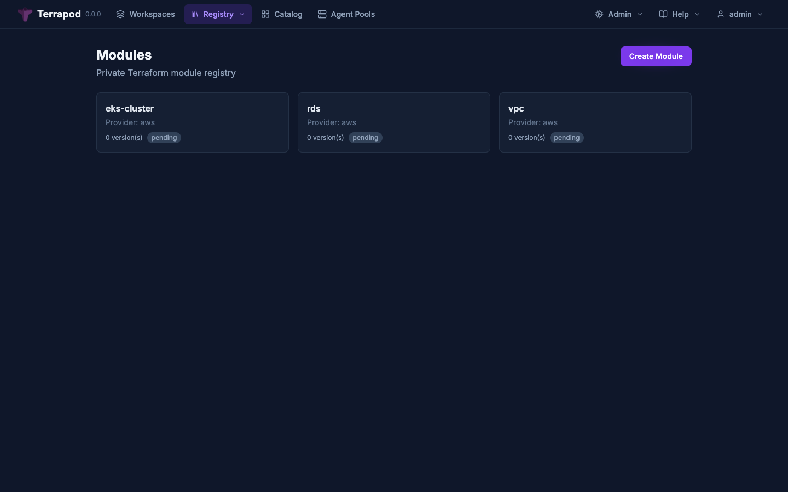
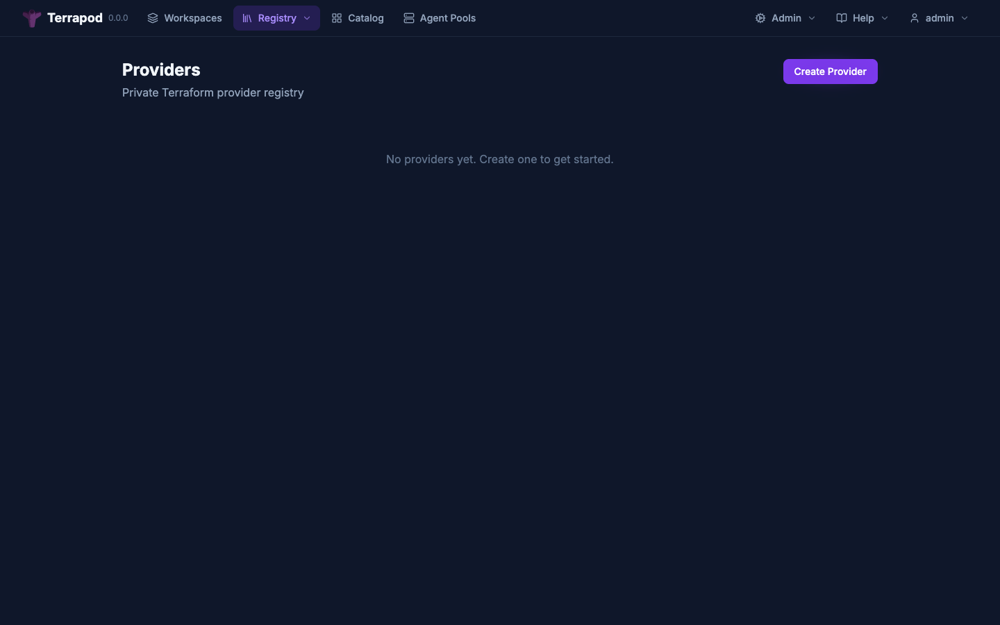
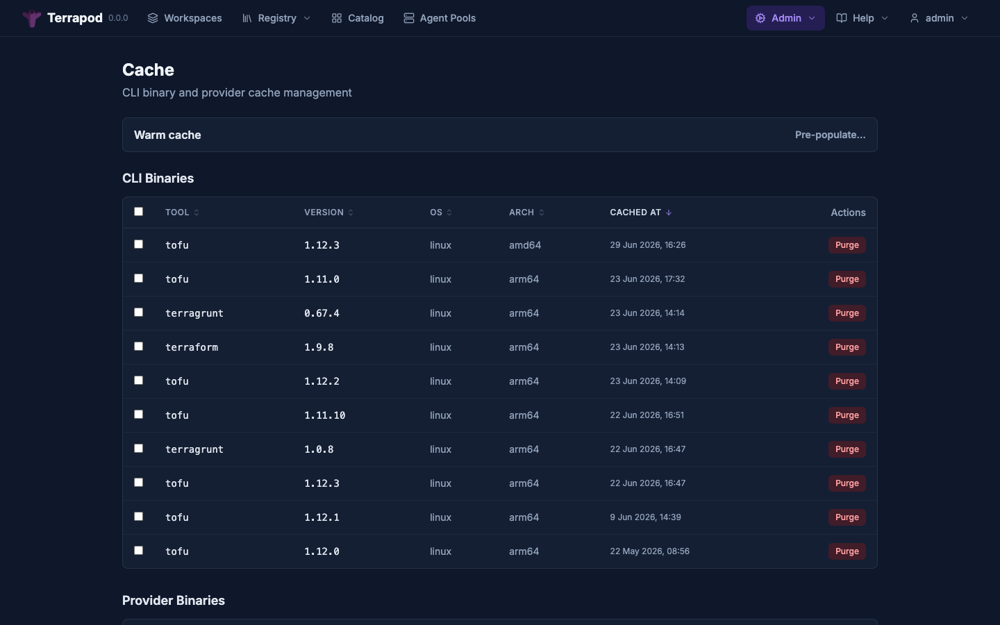

# Private Registry & Caching

Terrapod includes a private module and provider registry, plus pull-through caching for upstream public registries and terraform/tofu CLI binaries. This eliminates direct internet dependencies from runner Jobs.

---

## Overview

```
terraform init
    |
    +-- Module sources (e.g., "terrapod.local/myorg/vpc/aws")
    |       |
    |       +-- Terrapod Module Registry (private modules only)
    |
    +-- Provider sources (e.g., "hashicorp/aws")
            |
            +-- Network mirror (TF_CLI_CONFIG_FILE) --> Terrapod Provider Cache
                    |
                    +-- Cached? --> Serve from object storage
                    +-- Not cached? --> Fetch from registry.terraform.io, cache, serve
```

Both caching layers (providers and binaries) sit in front of the Terrapod API, so runner Jobs have zero direct upstream dependencies.

---

## Private Module Registry

Publish, version, and share Terraform modules internally.



### Creating a Module

```zsh
curl -X POST https://terrapod.example.com/api/v2/organizations/default/registry-modules \
  -H "Authorization: Bearer $TERRAPOD_TOKEN" \
  -H "Content-Type: application/vnd.api+json" \
  -d '{
    "data": {
      "type": "registry-modules",
      "attributes": {
        "name": "vpc",
        "namespace": "myorg",
        "provider": "aws"
      }
    }
  }'
```

### Creating a Version

```zsh
curl -X POST https://terrapod.example.com/api/v2/organizations/default/registry-modules/myorg/vpc/aws/versions \
  -H "Authorization: Bearer $TERRAPOD_TOKEN" \
  -H "Content-Type: application/vnd.api+json" \
  -d '{
    "data": {
      "type": "registry-module-versions",
      "attributes": {
        "version": "1.0.0"
      }
    }
  }'
```

The response includes a presigned `upload-url`. Upload the module tarball:

```zsh
# Create tarball from module directory
tar -czf module.tar.gz -C /path/to/module .

# Upload to presigned URL
curl -X PUT "<upload-url>" \
  -H "Content-Type: application/octet-stream" \
  --data-binary @module.tar.gz
```

### Using a Private Module

In your Terraform configuration:

```hcl
module "vpc" {
  source  = "terrapod.example.com/myorg/vpc/aws"
  version = "1.0.0"

  # module variables...
}
```

The Terraform CLI discovers the module registry via `/.well-known/terraform.json` which includes `modules.v1` pointing to the registry endpoint.

### Listing Modules

```zsh
curl https://terrapod.example.com/api/v2/organizations/default/registry-modules \
  -H "Authorization: Bearer $TERRAPOD_TOKEN"
```

### Module Versions

```zsh
# List versions (CLI protocol)
curl https://terrapod.example.com/api/v2/registry/modules/myorg/vpc/aws/versions \
  -H "Authorization: Bearer $TERRAPOD_TOKEN"

# Show specific version (TFE V2 API)
curl https://terrapod.example.com/api/v2/organizations/default/registry-modules/myorg/vpc/aws/1.0.0 \
  -H "Authorization: Bearer $TERRAPOD_TOKEN"
```

### Deleting a Module

```zsh
curl -X DELETE https://terrapod.example.com/api/v2/organizations/default/registry-modules/myorg/vpc/aws \
  -H "Authorization: Bearer $TERRAPOD_TOKEN"
```

### Storage Layout

Module tarballs are stored at:

```
registry/modules/{namespace}/{name}/{provider}/{version}.tar.gz
```

### RBAC

Modules follow the same owner + label RBAC model as workspaces:
- Creator becomes owner (admin permission)
- Label-based roles grant read/write/admin
- The `workspace_permission` on a role maps to registry permissions: `plan` maps to `read`

Module API responses include a `permissions` block (`can-update`, `can-destroy`, `can-create-version`) reflecting the caller's effective access. The web UI uses these to gate editing, deletion, and version upload controls.

**Self-lockout protection:** If a label change on a module or provider would reduce the caller's own access, the API returns 409 Conflict. The UI shows a warning banner with Revert / Save Anyway options. See the [RBAC docs](rbac.md#self-lockout-protection-on-label-changes) for details.

---

## VCS-Driven Module Publishing

Instead of uploading tarballs manually, you can connect a module to a VCS repository. Terrapod watches for new git tags and automatically publishes matching versions.

### Overview

1. Create a module in the registry
2. Connect it to a VCS repository (GitHub or GitLab) via the UI or API
3. Push semver tags (e.g. `v1.0.0`) to the repository
4. Terrapod's background poller detects the tag, downloads the archive, and creates the module version

### Setup via API

```zsh
# 1. Create the module
curl -X POST https://terrapod.example.com/api/v2/organizations/default/registry-modules \
  -H "Authorization: Bearer $TERRAPOD_TOKEN" \
  -H "Content-Type: application/vnd.api+json" \
  -d '{
    "data": {
      "type": "registry-modules",
      "attributes": { "name": "vpc", "provider": "aws" }
    }
  }'

# 2. Connect VCS
curl -X PATCH https://terrapod.example.com/api/v2/organizations/default/registry-modules/private/default/vpc/aws/vcs \
  -H "Authorization: Bearer $TERRAPOD_TOKEN" \
  -H "Content-Type: application/vnd.api+json" \
  -d '{
    "data": {
      "type": "registry-modules",
      "attributes": {
        "source": "vcs",
        "vcs_connection_id": "<connection-id>",
        "vcs_repo_url": "https://github.com/my-org/terraform-aws-vpc",
        "vcs_tag_pattern": "v*"
      }
    }
  }'
```

You can also configure VCS from the module detail page in the web UI using the **Connect VCS** button.

### Tag Patterns

The `vcs_tag_pattern` field uses glob syntax to match tags and extract version strings:

| Pattern | Tag Example | Extracted Version |
|---|---|---|
| `v*` (default) | `v1.2.3` | `1.2.3` |
| `release-*` | `release-1.0.0` | `1.0.0` |
| `*` | `1.0.0` | `1.0.0` |

Only tags matching the pattern are considered. The prefix before the `*` wildcard is stripped to produce the version string.

### Polling Behaviour

- The registry VCS poller runs as a periodic task via the distributed scheduler (default: every 60 seconds, shared with the workspace VCS poller interval)
- Exactly one replica executes each poll cycle (multi-replica safe via Redis)
- Each cycle queries all modules with `source=vcs` and a configured VCS connection, then lists tags from the VCS provider

### Git as Source of Truth

**Published versions track git, not the other way around.** If a tag is moved to a different commit (e.g. via `git tag -f v1.0.0 <new-sha> && git push --force --tags`), Terrapod detects the SHA mismatch on the next poll cycle, re-downloads the archive, and replaces the stored tarball. The `vcs-commit-sha` on the version record is updated to reflect the new commit.

This means:
- Versions are **not** immutable when backed by VCS
- The registry always reflects the current state of git tags
- Each version tracks which commit SHA and tag name produced it

### What Gets Stored

The archive at the tag ref is stored as a tarball at:

```
registry/modules/{namespace}/{name}/{provider}/{version}.tar.gz
```

### Manual Upload Still Works

Even with VCS connected, you can still upload versions directly via the API or web UI. Manually-uploaded versions will have empty `vcs-commit-sha` and `vcs-tag` fields.

### Version Metadata

Each version exposes VCS metadata in the API response:

| Field | Description |
|---|---|
| `vcs-commit-sha` | The git commit SHA this version was built from (empty for manual uploads) |
| `vcs-tag` | The tag name that matched (e.g. `v1.2.3`; empty for manual uploads) |

---

## Private Provider Registry

Publish, version, and share Terraform providers internally with GPG signing.



### GPG Key Management

Before publishing providers, register a GPG key for signature verification:

```zsh
# Export your GPG public key
gpg --armor --export your-key-id > public-key.asc

# Register with Terrapod
curl -X POST https://terrapod.example.com/api/registry/private/v2/gpg-keys \
  -H "Authorization: Bearer $TERRAPOD_TOKEN" \
  -H "Content-Type: application/vnd.api+json" \
  -d "{
    \"data\": {
      \"type\": \"gpg-keys\",
      \"attributes\": {
        \"namespace\": \"myorg\",
        \"ascii-armor\": \"$(cat public-key.asc)\"
      }
    }
  }"
```

The key ID is automatically extracted from the ASCII armor using `pgpy` (pure Python, no gpg binary needed on the server).

### Listing GPG Keys

```zsh
curl https://terrapod.example.com/api/registry/private/v2/gpg-keys \
  -H "Authorization: Bearer $TERRAPOD_TOKEN"
```

### Creating a Provider

```zsh
curl -X POST https://terrapod.example.com/api/v2/organizations/default/registry-providers \
  -H "Authorization: Bearer $TERRAPOD_TOKEN" \
  -H "Content-Type: application/vnd.api+json" \
  -d '{
    "data": {
      "type": "registry-providers",
      "attributes": {
        "name": "mycloud",
        "namespace": "myorg"
      }
    }
  }'
```

### Creating a Version

```zsh
curl -X POST https://terrapod.example.com/api/v2/organizations/default/registry-providers/myorg/mycloud/versions \
  -H "Authorization: Bearer $TERRAPOD_TOKEN" \
  -H "Content-Type: application/vnd.api+json" \
  -d '{
    "data": {
      "type": "registry-provider-versions",
      "attributes": {
        "version": "1.0.0",
        "key-id": "ABCDEF1234567890"
      }
    }
  }'
```

### Adding Platforms

For each OS/architecture combination:

```zsh
curl -X POST https://terrapod.example.com/api/v2/organizations/default/registry-providers/myorg/mycloud/versions/1.0.0/platforms \
  -H "Authorization: Bearer $TERRAPOD_TOKEN" \
  -H "Content-Type: application/vnd.api+json" \
  -d '{
    "data": {
      "type": "registry-provider-platforms",
      "attributes": {
        "os": "linux",
        "arch": "amd64",
        "filename": "terraform-provider-mycloud_1.0.0_linux_amd64.zip",
        "shasum": "e3b0c44298fc1c149afbf4c8996fb92427ae41e4649b934ca495991b7852b855"
      }
    }
  }'
```

Upload the binary, SHA256SUMS, and SHA256SUMS.sig files to the presigned URLs returned in the response.

### Using a Private Provider

```hcl
terraform {
  required_providers {
    mycloud = {
      source  = "terrapod.example.com/myorg/mycloud"
      version = "1.0.0"
    }
  }
}
```

### Storage Layout

```
registry/providers/{namespace}/{name}/{version}/
  terraform-provider-{name}_{version}_{os}_{arch}.zip
  SHA256SUMS
  SHA256SUMS.sig
```

---

## Provider Caching (Network Mirror)

The provider cache implements the Terraform network mirror protocol. Runner Jobs are configured to use Terrapod as their provider mirror, so all provider downloads go through the cache.

### How It Works

1. Runner Job has `TF_CLI_CONFIG_FILE` pointing to a config with:
   ```hcl
   provider_installation {
     network_mirror {
       url = "https://terrapod-api:8000/v1/providers/"
     }
   }
   ```
2. Terraform requests provider binaries from the mirror URL
3. Terrapod checks the cache (`cached_provider_packages` table)
4. Cache hit: redirect to presigned URL in object storage
5. Cache miss: fetch from upstream (`registry.terraform.io` or `registry.opentofu.org`), store, serve

### Configuration

```yaml
api:
  config:
    registry:
      provider_cache:
        enabled: true
        upstream_registries:
          - registry.terraform.io
          - registry.opentofu.org
        warm_on_first_request: true
```

### Network Mirror Endpoints

```
GET /v1/providers/{hostname}/{namespace}/{type}/index.json
```

Returns a version list for the provider.

```
GET /v1/providers/{hostname}/{namespace}/{type}/{version}.json
```

Returns platform-specific download URLs with `zh:` (zip hash) checksums.

### Runner Integration

Both `terraform` and `tofu` respect `TF_CLI_CONFIG_FILE`, so a single config file works for either backend. The listener injects this env var into runner Jobs automatically.

Runners should never fetch providers directly from upstream registries.

### Storage Layout

```
cache/providers/{hostname}/{namespace}/{type}/{version}/{filename}
```

---

## Binary Caching (Terraform/Tofu CLI)

The binary cache stores terraform and tofu CLI binaries so runner Jobs can fetch the exact version they need at startup, without downloading from the internet.

### How It Works

1. Runner Job starts with a generic image (no baked-in terraform/tofu binary)
2. Runner entrypoint calls `GET /api/v2/binary-cache/{tool}/{version}/{os}/{arch}`
3. API returns 302 redirect to presigned URL in object storage
4. Cache miss: API fetches from upstream (`releases.hashicorp.com` for terraform, GitHub releases for tofu), stores, redirects
5. Runner downloads binary and begins execution

### Configuration

```yaml
api:
  config:
    registry:
      binary_cache:
        enabled: true
        terraform_mirror_url: "https://releases.hashicorp.com/terraform"
        tofu_mirror_url: "https://github.com/opentofu/opentofu/releases/download"
```

### API Endpoints

**Download binary (used by runners):**
```
GET /api/v2/binary-cache/{tool}/{version}/{os}/{arch}
```

Returns 302 redirect to presigned URL.

**List cached binaries (admin):**
```zsh
curl https://terrapod.example.com/api/v2/admin/binary-cache \
  -H "Authorization: Bearer $TERRAPOD_TOKEN"
```

**Pre-warm cache (admin):**
```zsh
curl -X POST https://terrapod.example.com/api/v2/admin/binary-cache/warm \
  -H "Authorization: Bearer $TERRAPOD_TOKEN" \
  -H "Content-Type: application/json" \
  -d '{
    "tool": "terraform",
    "version": "1.9.8",
    "os": "linux",
    "arch": "amd64"
  }'
```

**Purge cached binary (admin):**
```zsh
curl -X DELETE https://terrapod.example.com/api/v2/admin/binary-cache/terraform/1.9.8/linux/amd64 \
  -H "Authorization: Bearer $TERRAPOD_TOKEN"
```

### Storage Layout

```
cache/binaries/{tool}/{version}/{os}_{arch}
```

### Admin UI

The web UI includes a binary cache admin page at `/admin/binary-cache` (admin-only) for viewing, warming, and purging cached binaries.



---

## Service Discovery

The `/.well-known/terraform.json` endpoint includes paths for both module and provider registries:

```json
{
  "modules.v1": "/api/v2/registry/modules/",
  "providers.v1": "/api/v2/registry/providers/"
}
```

This enables `terraform init` to discover private module and provider sources when the Terrapod hostname is used in `source` attributes.

---

## Complete Example: Air-Gapped Environment

For fully air-gapped environments where runner Jobs have no internet access:

1. **Pre-warm the binary cache** with the required terraform/tofu versions
2. **Pre-warm the provider cache** by running `terraform init` once from a machine with internet access (the first request populates the cache)
3. **Upload private modules** to the module registry

```yaml
api:
  config:
    registry:
      enabled: true
      provider_cache:
        enabled: true
        warm_on_first_request: true
      binary_cache:
        enabled: true
```

Runner Jobs only need network access to the Terrapod API (internal cluster networking).
