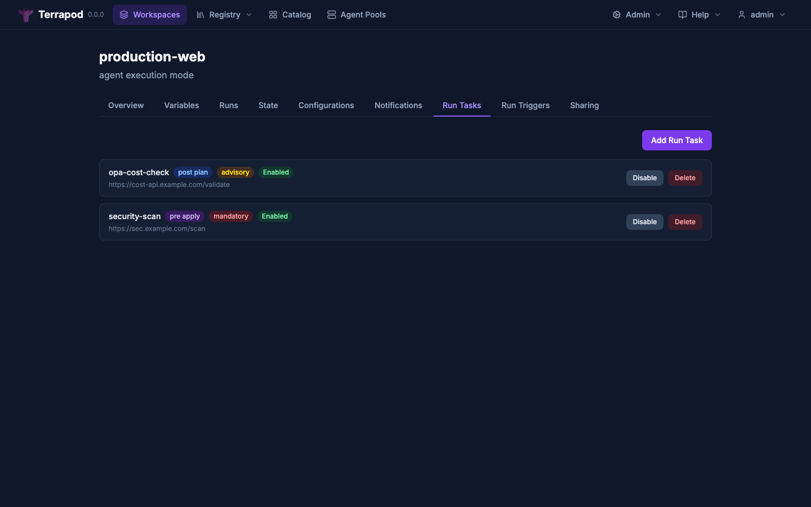

# Run Tasks

Run tasks are webhook hooks that call external services at specific points in a run's lifecycle for validation, policy checks, or approval workflows. Tasks can be **mandatory** (block the run on failure) or **advisory** (report results without blocking).

---

## How It Works

1. An admin configures a run task on a workspace, specifying a webhook URL, stage, and enforcement level
2. When a run reaches the configured stage boundary, Terrapod creates a task stage with results for each applicable task
3. The webhook is dispatched with an HMAC-signed payload containing run details and a callback URL
4. The external service processes the request and reports pass/fail via the callback endpoint
5. Terrapod resolves the stage status based on all results and enforcement levels

---

## Stages

Run tasks can be attached to three lifecycle boundaries:

| Stage | When It Fires | Use Case |
|---|---|---|
| `pre_plan` | Before planning starts | Input validation, cost estimation pre-checks |
| `post_plan` | After planning completes | Plan review, cost analysis, compliance checks |
| `pre_apply` | Before apply starts | Final approval, change advisory board sign-off |

---

## Enforcement Levels

| Level | Behaviour |
|---|---|
| `mandatory` | A failure blocks the run from proceeding. An admin can override |
| `advisory` | A failure is reported but does not block the run |

---



## API

### Task Management

Requires `admin` permission on the workspace for create, update, and delete. Requires `read` for list and show.

#### Create Task

```
POST /api/v2/workspaces/{id}/run-tasks
```

```json
{
  "data": {
    "attributes": {
      "name": "cost-check",
      "url": "https://cost-api.example.com/validate",
      "hmac-key": "secret-signing-key",
      "stage": "pre_apply",
      "enforcement-level": "mandatory",
      "enabled": true
    }
  }
}
```

#### List Tasks

```
GET /api/v2/workspaces/{id}/run-tasks
```

#### Show Task

```
GET /api/v2/run-tasks/{id}
```

#### Update Task

```
PATCH /api/v2/run-tasks/{id}
```

#### Delete Task

```
DELETE /api/v2/run-tasks/{id}
```

### Task Stages

#### List Stages for a Run

```
GET /api/v2/runs/{run_id}/task-stages
```

#### Show Stage (with Results)

```
GET /api/v2/task-stages/{id}
```

Returns the stage and its results as included resources.

#### Override Failed Stage

```
POST /api/v2/task-stages/{id}/actions/override
```

Requires `admin` permission. Only works on stages with `failed` status. Sets the stage to `overridden`, allowing the run to proceed.

### External Callback

```
PATCH /api/v2/task-stage-results/{id}/callback
```

No authentication header required — verified via `access_token` in the request body.

```json
{
  "access_token": "result-id:timestamp:hmac-signature",
  "status": "passed",
  "message": "All checks passed"
}
```

Valid callback statuses: `passed`, `failed`.

---

## Webhook Payload

When a task fires, Terrapod sends an HTTP POST to the configured URL:

```json
{
  "payload_version": 1,
  "stage": "pre_apply",
  "access_token": "result-id:timestamp:signature",
  "task_result_callback_url": "https://terrapod.local/api/v2/task-stage-results/tsr-id/callback",
  "run_id": "run-uuid",
  "run_status": "planning",
  "run_created_at": "2025-01-01T12:00:00Z",
  "workspace_id": "ws-uuid",
  "workspace_name": "production",
  "organization_name": "default",
  "task_name": "cost-check",
  "is_speculative": false
}
```

If an HMAC key is configured, the payload is signed with HMAC-SHA512 and the signature is sent in the `X-TFE-Task-Signature` header.

---

## HMAC Verification

Verify webhook signatures in your external service:

```python
import hmac
import hashlib

expected = hmac.new(
    hmac_key.encode(),
    request_body_bytes,
    hashlib.sha512
).hexdigest()

assert hmac.compare_digest(
    expected,
    request.headers["X-TFE-Task-Signature"]
)
```

---

## Callback Tokens

Callback tokens are short-lived (1 hour) HMAC-SHA256 signed tokens. They contain the result ID, a timestamp, and a signature derived from a server-side secret. The external service receives the token in the webhook payload and must include it in the callback request.

Token format: `{result_id}:{timestamp}:{hmac_sha256_signature}`

---

## Stage Resolution

After each callback (or webhook delivery error), Terrapod evaluates the stage:

1. If any results are still `pending` or `running` → stage remains `running`
2. If all results are terminal and any **mandatory** result failed → stage is `failed`
3. If all results are terminal with no mandatory failures → stage is `passed`

Advisory failures do not block stage resolution.

---

## Result Statuses

| Status | Meaning |
|---|---|
| `pending` | Webhook not yet dispatched |
| `running` | Webhook sent, awaiting callback |
| `passed` | External service reported success |
| `failed` | External service reported failure |
| `errored` | Webhook delivery returned non-2xx HTTP |
| `unreachable` | Network/connection error during delivery |

---

## Admin Override

When a mandatory task fails, the run is blocked. An admin can override the failed stage:

```bash
curl -X POST https://terrapod.local/api/v2/task-stages/ts-id/actions/override \
  -H "Authorization: Bearer $TOKEN"
```

This sets the stage status to `overridden` and allows the run to proceed.

---

## Example: OPA Policy Checks

[Open Policy Agent](https://www.openpolicyagent.org/) can be used as a post-plan run task to enforce infrastructure policies written in Rego. This gives you Sentinel-like guardrails without any Terrapod-side changes.

### Architecture

```
Run reaches "planned" stage
  → Terrapod sends webhook to your OPA service
  → OPA service fetches the plan JSON from Terrapod
  → OPA evaluates Rego policies against the plan
  → OPA posts pass/fail back via the callback URL
  → Terrapod blocks or allows the run based on enforcement level
```

### Example OPA Service (Python/Flask)

A minimal webhook receiver that evaluates Terraform plan JSON against OPA policies:

```python
"""Minimal OPA run task webhook receiver."""
import hashlib
import hmac
import json

import httpx
from flask import Flask, request, jsonify

app = Flask(__name__)

HMAC_KEY = "your-hmac-key"
OPA_URL = "http://localhost:8181/v1/data/terraform/deny"
TERRAPOD_TOKEN = "your-api-token"  # for fetching plan JSON


def verify_signature(body: bytes, signature: str) -> bool:
    expected = hmac.new(HMAC_KEY.encode(), body, hashlib.sha512).hexdigest()
    return hmac.compare_digest(expected, signature)


@app.route("/webhook", methods=["POST"])
def handle_task():
    # 1. Verify HMAC signature
    sig = request.headers.get("X-TFE-Task-Signature", "")
    if not verify_signature(request.data, sig):
        return jsonify({"error": "invalid signature"}), 401

    payload = request.json
    callback_url = payload["task_result_callback_url"]
    access_token = payload["access_token"]
    run_id = payload["run_id"]

    # 2. Fetch plan JSON from Terrapod
    plan_resp = httpx.get(
        f"https://terrapod.local/api/v2/runs/{run_id}/plan/json-output",
        headers={"Authorization": f"Bearer {TERRAPOD_TOKEN}"},
    )
    plan_json = plan_resp.json()

    # 3. Evaluate against OPA
    opa_resp = httpx.post(OPA_URL, json={"input": plan_json})
    violations = opa_resp.json().get("result", [])

    # 4. Report result via callback
    if violations:
        message = "Policy violations:\n" + "\n".join(f"- {v}" for v in violations)
        status = "failed"
    else:
        message = "All policies passed"
        status = "passed"

    httpx.patch(callback_url, json={
        "access_token": access_token,
        "status": status,
        "message": message,
    })

    return "", 200
```

### Example Rego Policy

```rego
# policy/terraform.rego — deny destructive changes to production databases
package terraform

deny[msg] {
    rc := input.resource_changes[_]
    rc.type == "aws_db_instance"
    rc.change.actions[_] == "delete"
    msg := sprintf("Deleting RDS instance %q is not allowed", [rc.address])
}

deny[msg] {
    rc := input.resource_changes[_]
    rc.type == "aws_s3_bucket"
    rc.change.actions[_] == "delete"
    msg := sprintf("Deleting S3 bucket %q is not allowed", [rc.address])
}
```

### Setup

1. Deploy your OPA service and load your Rego policies
2. Create a run task on the workspace:

```bash
curl -X POST https://terrapod.local/api/v2/workspaces/ws-ID/run-tasks \
  -H "Authorization: Bearer $TOKEN" \
  -H "Content-Type: application/vnd.api+json" \
  -d '{
    "data": {
      "attributes": {
        "name": "opa-policy-check",
        "url": "https://your-opa-service.internal/webhook",
        "hmac-key": "your-hmac-key",
        "stage": "post_plan",
        "enforcement-level": "mandatory",
        "enabled": true
      }
    }
  }'
```

3. All subsequent runs on this workspace will be evaluated against your OPA policies after the plan completes. Mandatory enforcement blocks the apply if any policies fail; an admin can override if needed.

---

## See Also

- [Notifications](notifications.md) — run lifecycle notifications
- [Architecture](architecture.md) — run state machine
- [API Reference](api-reference.md) — full endpoint documentation
